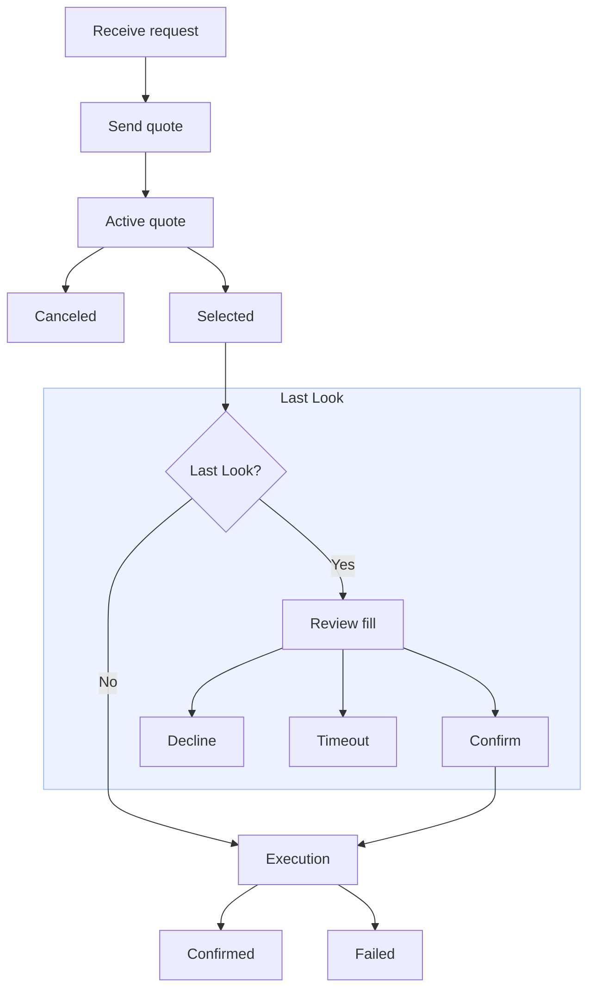

# Market Makers

> Build a market maker integration for pricing and executing Combos

This guide shows market makers how to handle Combo RFQs. You will open a quoting
session, respond to incoming requests, cancel submitted quotes when needed,
confirm fills through Last Look, and monitor execution updates.

<Note>
  For development updates on market making for Combos, join the [Combos market
  maker Telegram group](https://t.me/+eyMtdtKasWZjYTMx).
</Note>

## Start Quoting

Start by preparing an authenticated quoting session with the RFQ system. You
need a Polymarket account; create one at [polymarket.com](https://polymarket.com).

<Tabs>
  <Tab title="TypeScript">
    <Steps>
      <Step title="Install the Package">
        Install the Unified TypeScript SDK with the package manager of your choice.

        <CodeGroup>
          ```bash pnpm theme={null}
          pnpm add @polymarket/client@latest viem
          ```

          ```bash npm theme={null}
          npm install @polymarket/client@latest viem
          ```

          ```bash yarn theme={null}
          yarn add @polymarket/client@latest viem
          ```
        </CodeGroup>

        <Note>
          This page uses Viem for wallet signing. See the [TypeScript tooling
          guide](/getting-started/typescript#wallet-integrations) for other wallet
          library integrations.
        </Note>
      </Step>

      <Step title="Create a Secure Client">
        Create a `SecureClient` with a wallet that has funds for fulfilling
        user requests and its signer details.

        ```ts theme={null}
        import { createSecureClient, relayerApiKey } from "@polymarket/client";
        import { privateKey } from "@polymarket/client/viem";

        const client = await createSecureClient({
          wallet: process.env.POLYMARKET_WALLET_ADDRESS!,
          signer: privateKey(process.env.PRIVATE_KEY!),
          apiKey: relayerApiKey({
            key: process.env.RELAYER_API_KEY!,
            address: process.env.RELAYER_API_KEY_ADDRESS!,
          }),
        });
        ```

        The Relayer API key is necessary for setting up trading approvals in the next
        step. Create a [Relayer API key](https://polymarket.com/settings?tab=api-keys)
        from polymarket.com → Settings → API Keys.
      </Step>

      <Step title="Set Up Trading Approvals">
        Set up the approvals required to fill user requests.

        ```ts theme={null}
        await client.setupTradingApprovals();
        ```
      </Step>

      <Step title="Open an RFQ Session">
        Open the RFQ session.

        ```ts theme={null}
        const session = await client.openRfqSession();

        for await (const event of session) {
          // event: RfqEvent
        }
        ```
      </Step>

      <Step title="Close the Session">
        You can close the session at any time by calling `session.close()`.

        ```ts theme={null}
        for await (const event of session) {
          if (shouldCloseSession) {
            await session.close();
            break;
          }

          // …
        }
        ```
      </Step>
    </Steps>
  </Tab>

  <Tab title="Python">
    <Steps>
      <Step title="Install the Package">
        Install the Python SDK with the package manager of your choice.

        <CodeGroup>
          ```bash uv theme={null}
          uv add polymarket-client
          ```

          ```bash pip theme={null}
          pip install polymarket-client
          ```

          ```bash poetry theme={null}
          poetry add polymarket-client
          ```
        </CodeGroup>
      </Step>

      <Step title="Create a Secure Client">
        Create an `AsyncSecureClient` with a wallet that has funds for fulfilling user
        requests and its signer details.

        ```python theme={null}
        import os

        from polymarket import AsyncSecureClient, RelayerApiKey


        client = await AsyncSecureClient.create(
            private_key=os.environ["PRIVATE_KEY"],
            wallet=os.environ["POLYMARKET_WALLET_ADDRESS"],
            api_key=RelayerApiKey(
                key=os.environ["RELAYER_API_KEY"],
                address=os.environ["RELAYER_API_KEY_ADDRESS"],
            ),
        )
        ```

        The Relayer API key is necessary for setting up trading approvals in the next
        step. Create a [Relayer API key](https://polymarket.com/settings?tab=api-keys)
        from polymarket.com → Settings → API Keys.
      </Step>

      <Step title="Set Up Trading Approvals">
        Set up the approvals required to fill user requests.

        ```python theme={null}
        await client.setup_trading_approvals()
        ```
      </Step>

      <Step title="Open an RFQ Session">
        Open the RFQ session.

        ```python theme={null}
        async with client.open_rfq_session() as session:
            async for event in session:
                # event: RfqEvent
                ...
        ```
      </Step>

      <Step title="Close the Session">
        You can close the session at any time by calling `await session.close()`.

        ```python theme={null}
        async with client.open_rfq_session() as session:
            async for event in session:
                if should_close_session:
                    await session.close()
                    break

                ...
        ```
      </Step>
    </Steps>
  </Tab>

  <Tab title="API">
    <Note>
      Use Polygon mainnet chain ID `137` for CLOB authentication and Exchange v3
      order signing.
    </Note>

    <Steps>
      <Step title="Open the WebSocket">
        Connect to the RFQ system WebSocket.

        ```text theme={null}
        wss://combos-rfq-gateway-quoter.polymarket.com/ws/rfq
        ```

        To inspect the stream before integrating:

        ```bash theme={null}
        wscat -c "wss://combos-rfq-gateway-quoter.polymarket.com/ws/rfq"
        ```

        Some write operations are also available through the REST API.

        ```text theme={null}
        https://combos-rfq-api.polymarket.com
        ```
      </Step>

      <Step title="Acquire CLOB Credentials">
        RFQ WebSocket authentication uses CLOB API credentials: API key, secret, and
        passphrase. If you need credentials, start with [Getting API
        Credentials](/getting-started/api#authentication).
      </Step>

      <Step title="Resolve Quoter Identity">
        Resolve the order signer identity before sending `auth`. The RFQ system needs
        the address that signs the order, the wallet that funds the order, and the
        signature type that connects those two addresses.

        | Wallet Type    | `signature_type` | `signer_address`              | `maker_address`      |
        | -------------- | ---------------- | ----------------------------- | -------------------- |
        | Deposit Wallet | `3` POLY\_1271   | Deposit wallet address        | Deposit wallet       |
        | Safe Wallet    | `2` Safe         | Authenticated signing address | Derived Safe wallet  |
        | Proxy Wallet   | `1` Proxy        | Authenticated signing address | Derived proxy wallet |
        | EOA            | `0` EOA          | EOA address                   | Same EOA address     |

        For more detail, see [Wallets and Authentication](/trading/wallets-auth#wallet-types).
      </Step>

      <Step title="Authenticate">
        Send `auth` as the first WebSocket message within 30 seconds. Include the CLOB
        credentials and the `signer_address`, `maker_address`, and `signature_type`
        values resolved in the previous step. This example uses a Deposit Wallet.

        ```json theme={null}
        {
          "type": "auth",
          "auth": {
            "apiKey": "YOUR_API_KEY",
            "secret": "YOUR_API_SECRET",
            "passphrase": "YOUR_API_PASSPHRASE"
          },
          "identity": {
            "signer_address": "<signer_address>",
            "maker_address": "<maker_address>",
            "signature_type": 3 // <signature_type>
          }
        }
        ```

        Authentication returns a success or failure response.

        <CodeGroup>
          ```json Success theme={null}
          {
            "type": "auth",
            "success": true,
            "address": "0xAuthenticatedAddress",
            "role": "maker"
          }
          ```

          ```json Failure theme={null}
          {
            "type": "auth",
            "success": false,
            "error": "unauthenticated"
          }
          ```
        </CodeGroup>

        <Note>
          The RFQ system uses WebSocket protocol heartbeat frames to keep the connection
          alive. It sends a ping frame every 30 seconds with payload `rfq`; your client
          must respond with a pong frame that echoes the same payload. Most WebSocket
          clients handle this automatically. These are protocol frames, not JSON
          messages in the RFQ event stream. The gateway closes stale connections after 2
          minutes without an inbound message or pong.
        </Note>
      </Step>

      <Step title="Check Approval Requirements">
        Before posting quotes or managing Combo inventory, `maker_address` must approve
        the contracts that may transfer its assets.

        | Approval                    | Required when                                     | Contract call                                           |
        | --------------------------- | ------------------------------------------------- | ------------------------------------------------------- |
        | pUSD collateral             | The quoted order transfers pUSD                   | `CollateralToken.approve(ExchangeV3, maxUint256)`       |
        | Combo positions             | The quoted order transfers Combo positions        | `PositionManager.setApprovalForAll(ExchangeV3, true)`   |
        | Router pUSD collateral      | You split pUSD into positions through the Router  | `CollateralToken.approve(Router, maxUint256)`           |
        | Router positions            | You manage or redeem positions through the Router | `PositionManager.setApprovalForAll(Router, true)`       |
        | AutoRedeemer Combo operator | You want automatic redemption flows to use it     | `PositionManager.setApprovalForAll(AutoRedeemer, true)` |

        Use these contract addresses to build the approval calls.

        | Contract              | Address                                      |
        | --------------------- | -------------------------------------------- |
        | pUSD collateral token | `0xC011a7E12a19f7B1f670d46F03B03f3342E82DFB` |
        | Exchange v3           | `0xe3333700cA9d93003F00f0F71f8515005F6c00Aa` |
        | Router                | `0x12121212006e4CD160D18e3f00711DA5c3372600` |
        | PositionManager       | `0x006F54F7f9A22e0000CC2AB60031000000ae9fEF` |
        | AutoRedeemer          | `0xa1200000d0002264C9a1698e001292D00E1b00af` |

        <Note>
          The following steps use the Deposit Wallet [gasless transaction
          flow](/trading/wallets-auth#execute-gasless-transactions). If you are trading
          with an EOA, submit the approvals directly from `maker_address`. For Safe or
          Proxy Wallet flows, use an SDK.
        </Note>
      </Step>

      <Step title="Build the Approval Call List">
        Encode the approval calls that are not already in place.

        <CodeGroup>
          ```solidity ERC-20 Approval theme={null}
          function approve(address spender, uint256 amount) returns (bool);
          ```

          ```solidity ERC-1155 Approval theme={null}
          function setApprovalForAll(address operator, bool approved);
          ```
        </CodeGroup>

        Build a relayer call list from the encoded calldata.

        ```json theme={null}
        [
          {
            "target": "0xC011a7E12a19f7B1f670d46F03B03f3342E82DFB",
            "value": "0",
            "data": "<approve_exchange_v3_calldata>"
          },
          {
            "target": "0xC011a7E12a19f7B1f670d46F03B03f3342E82DFB",
            "value": "0",
            "data": "<approve_router_calldata>"
          },
          {
            "target": "0x006F54F7f9A22e0000CC2AB60031000000ae9fEF",
            "value": "0",
            "data": "<approve_exchange_v3_operator_calldata>"
          },
          {
            "target": "0x006F54F7f9A22e0000CC2AB60031000000ae9fEF",
            "value": "0",
            "data": "<approve_router_operator_calldata>"
          },
          {
            "target": "0x006F54F7f9A22e0000CC2AB60031000000ae9fEF",
            "value": "0",
            "data": "<approve_auto_redeemer_operator_calldata>"
          }
        ]
        ```
      </Step>

      <Step title="Fetch the Nonce">
        Fetch a fresh `WALLET` nonce before signing the batch.

        ```bash theme={null}
        curl -G "https://relayer-v2.polymarket.com/v1/account/transactions/params" \
          -H "RELAYER_API_KEY: $RELAYER_API_KEY" \
          -H "RELAYER_API_KEY_ADDRESS: $RELAYER_API_KEY_ADDRESS" \
          --data-urlencode "address=$RELAYER_API_KEY_ADDRESS" \
          --data-urlencode "type=WALLET"
        ```

        The response includes the nonce to sign with the transaction.

        ```json theme={null}
        {
          "address": "<RELAYER_API_KEY_ADDRESS>",
          "nonce": "<wallet_nonce>"
        }
        ```
      </Step>

      <Step title="Submit the Transaction">
        Build and sign a Deposit Wallet `Batch` with the owner. Use the approval calls
        from the call-list step as `calls`.

        ```json EIP-712 Batch theme={null}
        {
          "domain": {
            "name": "DepositWallet",
            "version": "1",
            "chainId": 137,
            "verifyingContract": "<maker_address>"
          },
          "types": {
            "Call": [
              { "name": "target", "type": "address" },
              { "name": "value", "type": "uint256" },
              { "name": "data", "type": "bytes" }
            ],
            "Batch": [
              { "name": "wallet", "type": "address" },
              { "name": "nonce", "type": "uint256" },
              { "name": "deadline", "type": "uint256" },
              { "name": "calls", "type": "Call[]" }
            ]
          },
          "primaryType": "Batch",
          "message": {
            "wallet": "<maker_address>",
            "nonce": "<wallet_nonce>",
            "deadline": "<unix_seconds>",
            "calls": [
              {
                "target": "0xC011a7E12a19f7B1f670d46F03B03f3342E82DFB",
                "value": "0",
                "data": "<approval_calldata>"
              }
            ]
          }
        }
        ```

        Submit the signed batch to the relayer.

        ```bash theme={null}
        curl -X POST "https://relayer-v2.polymarket.com/submit" \
          -H "Content-Type: application/json" \
          -H "RELAYER_API_KEY: $RELAYER_API_KEY" \
          -H "RELAYER_API_KEY_ADDRESS: $RELAYER_API_KEY_ADDRESS" \
          -d '{
            "type": "WALLET",
            "from": "<relayer_api_key_address>",
            "to": "0x00000000000Fb5C9ADea0298D729A0CB3823Cc07",
            "nonce": "<wallet_nonce>",
            "signature": "<wallet_batch_signature>",
            "metadata": "Approve Combo RFQ contracts",
            "depositWalletParams": {
              "depositWallet": "<maker_address>",
              "deadline": "<unix_seconds>",
              "calls": [
                {
                  "target": "0xC011a7E12a19f7B1f670d46F03B03f3342E82DFB",
                  "value": "0",
                  "data": "<approval_calldata>"
                }
              ]
            }
          }'
        ```

        The response includes the relayer transaction ID.

        ```json theme={null}
        {
          "transactionID": "<transaction_id>",
          "state": "STATE_NEW"
        }
        ```
      </Step>

      <Step title="Poll the Transaction">
        Poll the relayer transaction until it reaches `STATE_CONFIRMED` before posting
        quotes that rely on those approvals.

        ```bash theme={null}
        curl "https://relayer-v2.polymarket.com/v1/account/transactions/<transaction_id>" \
          -H "RELAYER_API_KEY: $RELAYER_API_KEY" \
          -H "RELAYER_API_KEY_ADDRESS: $RELAYER_API_KEY_ADDRESS"
        ```

        ```json theme={null}
        {
          "transaction_id": "<transaction_id>",
          "transaction_hash": "<transaction_hash>",
          "state": "STATE_CONFIRMED",
          "error_msg": null
        }
        ```

        Treat `STATE_FAILED` and `STATE_INVALID` as terminal failures.
      </Step>
    </Steps>
  </Tab>
</Tabs>

## Handle Quote Requests

Quote requests describe a user's intent to buy or sell shares in a Combo defined
by a given set of legs. A quote request can currently only buy or sell the YES
side of a Combo.

The following cases show how a market maker can satisfy a user's buy or sell
request using collateral or inventory.

| Quote Request | Using Collateral      | From Inventory         |
| ------------- | --------------------- | ---------------------- |
| Buy YES       | Buy NO at `1 - price` | Sell YES at `price`    |
| Sell YES      | Buy YES at `price`    | Sell NO at `1 - price` |

See [Combinatorial Positions](/trading/positions/combinatorial) for more detail
on the YES/NO position model.

The diagram below shows the maker-side quote lifecycle, from receiving a quote
request through its terminal outcome.



### Authorize the Quote

Authorize each quote by pricing the request and returning a signed order to the
RFQ system. Quoters should respond within the **400 ms** submission window.

<Tabs>
  <Tab title="TypeScript">
    <Steps>
      <Step title="Switch on Event Type">
        First, switch on `event.type` to handle quote requests from the session stream.

        ```ts theme={null}
        switch (event.type) {
          case "quote_request":
            // event: RfqQuoteRequestEvent
            void handleQuoteRequest(event);
            break;

          // …
        }
        ```
      </Step>

      <Step title="Evaluate Request">
        Then, inspect the `RfqQuoteRequestEvent` before pricing it.

        | Field                | Type                   | Description                                |
        | -------------------- | ---------------------- | ------------------------------------------ |
        | `rfqId`              | `RfqId`                | RFQ identifier used to correlate responses |
        | `requestorPublicId`  | `RfqRequestorPublicId` | Public identifier for the user request     |
        | `conditionId`        | `ComboConditionId`     | Derived Combo condition ID                 |
        | `direction`          | `RfqDirection`         | Whether the user wants to buy or sell      |
        | `side`               | `RfqSide.Yes`          | Currently always `RfqSide.Yes`             |
        | `requestedSize`      | `RfqRequestedSize`     | User-requested notional or share size      |
        | `yesPositionId`      | `PositionId`           | Derived YES Combo position ID              |
        | `noPositionId`       | `PositionId`           | Derived NO Combo position ID               |
        | `legPositionIds`     | `PositionId[]`         | Underlying leg position IDs                |
        | `submissionDeadline` | `EpochMilliseconds`    | Unix-millisecond quote submission deadline |

        `requestedSize` is an `RfqRequestedSize` value that describes how the user sized
        the request.

        ```ts theme={null}
        type RfqRequestedSize =
          | {
              unit: RfqRequestedSizeUnit.Notional;
              value: DecimalString;
            }
          | {
              unit: RfqRequestedSizeUnit.Shares;
              value: DecimalString;
            };
        ```

        Where:

        * `notional`: the target value of the request in collateral currency. For
          example, `"3"` means the user wants roughly 3 pUSD worth of the Combo, with the
          resulting share size derived from the quote price. `notional` is always and only used by BUY requests.
        * `shares`: the target number of Combo outcome tokens. For example, `"10"` means
          the user wants 10 shares, or 10,000,000 base units. `shares` is always and only used by SELL requests.

        In both cases, `value` is a normalized decimal string.
      </Step>

      <Step title="Submission">
        Finally, handle pricing, quote submission, and persistence outside the session
        loop before the `event.submissionDeadline` deadline. Price the request as pUSD
        per YES Combo share; for example, `0.45` means `0.45` pUSD per share. If you do
        not want to quote the request, skip submission.

        ```ts theme={null}
        async function handleQuoteRequest(event: RfqQuoteRequestEvent) {
          const price = priceComboRequest(event);

          if (price === undefined) return;

          const reference = await event.quote({ price });

          storeQuoteReference(reference);
        }
        ```
      </Step>
    </Steps>
  </Tab>

  <Tab title="Python">
    <Steps>
      <Step title="Check Event Type">
        First, use `isinstance(...)` to handle quote requests from the session stream.

        ```python theme={null}
        from polymarket import RfqQuoteRequestEvent


        async for event in session:
            if isinstance(event, RfqQuoteRequestEvent):
                await handle_quote_request(event)
        ```
      </Step>

      <Step title="Evaluate Request">
        Then, inspect the `RfqQuoteRequestEvent` before pricing it.

        | Field                 | Type                     | Description                                |
        | --------------------- | ------------------------ | ------------------------------------------ |
        | `rfq_id`              | `RfqId`                  | RFQ identifier used to correlate responses |
        | `requestor_public_id` | `RfqRequestorPublicId`   | Public identifier for the user request     |
        | `condition_id`        | `ComboConditionId`       | Derived Combo condition ID                 |
        | `direction`           | `RfqDirection`           | Whether the user wants to buy or sell      |
        | `side`                | `RfqSide`                | Currently always `RfqSide.YES`             |
        | `requested_size`      | `RfqRequestedSize`       | User-requested notional or share size      |
        | `yes_position_id`     | `PositionId`             | Derived YES Combo position ID              |
        | `no_position_id`      | `PositionId`             | Derived NO Combo position ID               |
        | `leg_position_ids`    | `tuple[PositionId, ...]` | Underlying leg position IDs                |
        | `submission_deadline` | `int`                    | Unix-millisecond quote submission deadline |

        `requested_size` is an `RfqRequestedSize` value that describes how the user sized
        the request.

        ```python theme={null}
        from dataclasses import dataclass
        from decimal import Decimal

        from polymarket import RfqRequestedSizeUnit


        @dataclass(frozen=True, slots=True, kw_only=True)
        class RfqRequestedSize:
            unit: RfqRequestedSizeUnit
            value: Decimal
        ```

        Where:

        * `RfqRequestedSizeUnit.NOTIONAL`: the target value of the request in collateral
          currency. For example, `Decimal("3")` means the user wants roughly 3 pUSD worth
          of the Combo, with the resulting share size derived from the quote price.
          BUY RFQs will always use `NOTIONAL`.
        * `RfqRequestedSizeUnit.SHARES`: the target number of Combo outcome tokens. For
          example, `Decimal("10")` means the user wants 10 shares, or 10,000,000 base
          units. SELL RFQs will always use `SHARES`.

        In both cases, `value` is a `Decimal`.
      </Step>

      <Step title="Submission">
        Finally, handle pricing, quote submission, and persistence outside the session
        loop before the `event.submission_deadline` deadline. Price the request as pUSD
        per YES Combo share; for example, `Decimal("0.45")` means `0.45` pUSD per share.
        If you do not want to quote the request, skip submission.

        ```python theme={null}
        from decimal import Decimal

        from polymarket import RfqQuoteRequestEvent


        async def handle_quote_request(event: RfqQuoteRequestEvent) -> None:
            price = price_combo_request(event)

            if price is None:
                return

            reference = await event.quote(price=price)

            store_quote_reference(reference)
        ```
      </Step>
    </Steps>
  </Tab>

  <Tab title="API">
    <Steps>
      <Step title="Receive the Quote Request">
        The RFQ system sends `RFQ_REQUEST` messages over the authenticated WebSocket.
        Inspect the request before pricing it.

        <CodeGroup>
          ```json Notional Request theme={null}
          {
            "type": "RFQ_REQUEST",
            "rfq_id": "<rfq_id>",
            "requestor_public_id": "<requestor_public_id>",
            "leg_position_ids": ["<leg_position_id_1>", "<leg_position_id_2>"],
            "condition_id": "<condition_id>",
            "yes_position_id": "<yes_position_id>",
            "no_position_id": "<no_position_id>",
            "direction": "BUY",
            "side": "YES",
            "requested_size": {
              "unit": "notional",
              "value_e6": "1000000"
            },
            "submission_deadline": "<unix_milliseconds>"
          }
          ```

          ```json Shares Request theme={null}
          {
            "type": "RFQ_REQUEST",
            "rfq_id": "<rfq_id>",
            "requestor_public_id": "<requestor_public_id>",
            "leg_position_ids": ["<leg_position_id_1>", "<leg_position_id_2>"],
            "condition_id": "<condition_id>",
            "yes_position_id": "<yes_position_id>",
            "no_position_id": "<no_position_id>",
            "direction": "SELL",
            "side": "YES",
            "requested_size": {
              "unit": "shares",
              "value_e6": "1000000"
            },
            "submission_deadline": "<unix_milliseconds>"
          }
          ```
        </CodeGroup>

        A `BUY` request always uses `notional` sizing, which specifies a target pUSD
        amount and derives the fillable share size from the quote price. A `SELL`
        request always uses `shares` sizing, which specifies the exact number of Combo
        outcome tokens requested to sell.
      </Step>

      <Step title="Build the Order">
        Decide the `price` in base units for a full share. A full share is `1000000`
        share base units, and `1` pUSD is `1000000` pUSD base units. For example, a
        price of `0.45` pUSD per share means `price = 450000`.

        Determine `size` from the request:

        | `requested_size.unit` | `size`                                             |
        | --------------------- | -------------------------------------------------- |
        | `notional`            | `floor(requested_size.value_e6 * 1000000 / price)` |
        | `shares`              | `requested_size.value_e6`                          |

        Then determine the order token and amounts:

        | Quote Request | Token             | `makerAmount`                              | `takerAmount` |
        | ------------- | ----------------- | ------------------------------------------ | ------------- |
        | `SELL` YES    | `yes_position_id` | `ceil(price * size / 1000000)`             | `size`        |
        | `BUY` YES     | `no_position_id`  | `ceil((1000000 - price) * size / 1000000)` | `size`        |

        The examples below quote `1` share, so `size = 1000000`.

        <CodeGroup>
          ```json SELL Request theme={null}
          {
            "salt": "<order_salt>",
            "maker": "<maker_address>",
            "signer": "<signer_address>",
            "tokenId": "<yes_position_id>",
            "makerAmount": "450000",
            "takerAmount": "1000000",
            "side": 0,
            "signatureType": 3, // <signature_type>
            "timestamp": "<unix_seconds>",
            "metadata": "0x0000000000000000000000000000000000000000000000000000000000000000",
            "builder": "0x0000000000000000000000000000000000000000000000000000000000000000"
          }
          ```

          ```json BUY Request theme={null}
          {
            "salt": "<order_salt>",
            "maker": "<maker_address>",
            "signer": "<signer_address>",
            "tokenId": "<no_position_id>",
            "makerAmount": "550000",
            "takerAmount": "1000000",
            "side": 0,
            "signatureType": 3, // <signature_type>
            "timestamp": "<unix_seconds>",
            "metadata": "0x0000000000000000000000000000000000000000000000000000000000000000",
            "builder": "0x0000000000000000000000000000000000000000000000000000000000000000"
          }
          ```
        </CodeGroup>
      </Step>

      <Step title="Build EIP-712 Typed Data">
        Build the EIP-712 typed-data payload for your wallet type:

        * Use `depositWalletTypedData` when `signature_type` is `3`.
        * Use `exchangeV3OrderTypedData` when `signature_type` is `0`, `1`, or `2`.

        <CodeGroup>
          ```json depositWalletTypedData theme={null}
          {
            "domain": {
              "name": "Polymarket CTF Exchange",
              "version": "3",
              "chainId": 137,
              "verifyingContract": "0xe3333700cA9d93003F00f0F71f8515005F6c00Aa"
            },
            "types": {
              "Order": [
                { "name": "salt", "type": "uint256" },
                { "name": "maker", "type": "address" },
                { "name": "signer", "type": "address" },
                { "name": "tokenId", "type": "uint256" },
                { "name": "makerAmount", "type": "uint256" },
                { "name": "takerAmount", "type": "uint256" },
                { "name": "side", "type": "uint8" },
                { "name": "signatureType", "type": "uint8" },
                { "name": "timestamp", "type": "uint256" },
                { "name": "metadata", "type": "bytes32" },
                { "name": "builder", "type": "bytes32" }
              ],
              "TypedDataSign": [
                { "name": "contents", "type": "Order" },
                { "name": "name", "type": "string" },
                { "name": "version", "type": "string" },
                { "name": "chainId", "type": "uint256" },
                { "name": "verifyingContract", "type": "address" },
                { "name": "salt", "type": "bytes32" }
              ]
            },
            "primaryType": "TypedDataSign",
            "message": {
              "contents": {
                "salt": "<order_salt>",
                "maker": "<maker_address>",
                "signer": "<signer_address>",
                "tokenId": "<yes_position_id>",
                "makerAmount": "450000",
                "takerAmount": "1000000",
                "side": 0,
                "signatureType": 3, // <signature_type>
                "timestamp": "<unix_seconds>",
                "metadata": "0x0000000000000000000000000000000000000000000000000000000000000000",
                "builder": "0x0000000000000000000000000000000000000000000000000000000000000000"
              },
              "name": "DepositWallet",
              "version": "1",
              "chainId": 137,
              "verifyingContract": "0xYourDepositWallet",
              "salt": "0x0000000000000000000000000000000000000000000000000000000000000000"
            }
          }
          ```

          ```json exchangeV3OrderTypedData theme={null}
          {
            "domain": {
              "name": "Polymarket CTF Exchange",
              "version": "3",
              "chainId": 137,
              "verifyingContract": "0xe3333700cA9d93003F00f0F71f8515005F6c00Aa"
            },
            "types": {
              "EIP712Domain": [
                { "name": "name", "type": "string" },
                { "name": "version", "type": "string" },
                { "name": "chainId", "type": "uint256" },
                { "name": "verifyingContract", "type": "address" }
              ],
              "Order": [
                { "name": "salt", "type": "uint256" },
                { "name": "maker", "type": "address" },
                { "name": "signer", "type": "address" },
                { "name": "tokenId", "type": "uint256" },
                { "name": "makerAmount", "type": "uint256" },
                { "name": "takerAmount", "type": "uint256" },
                { "name": "side", "type": "uint8" },
                { "name": "signatureType", "type": "uint8" },
                { "name": "timestamp", "type": "uint256" },
                { "name": "metadata", "type": "bytes32" },
                { "name": "builder", "type": "bytes32" }
              ]
            },
            "primaryType": "Order",
            "message": {
              "salt": "<order_salt>",
              "maker": "0xYourEoaAddress",
              "signer": "0xYourEoaAddress",
              "tokenId": "<yes_position_id>",
              "makerAmount": "450000",
              "takerAmount": "1000000",
              "side": 0,
              "signatureType": 0, // <signature_type>
              "timestamp": "<unix_seconds>",
              "metadata": "0x0000000000000000000000000000000000000000000000000000000000000000",
              "builder": "0x0000000000000000000000000000000000000000000000000000000000000000"
            }
          }
          ```
        </CodeGroup>

        Both payloads use the Exchange v3 EIP-712 domain. `exchangeV3OrderTypedData` is
        the direct Exchange v3 `Order` payload. `depositWalletTypedData` is a
        `TypedDataSign` wrapper whose `contents` field is the Exchange v3 order and
        whose message includes the Deposit Wallet validation fields.
      </Step>

      <Step title="Sign the Order">
        Sign the typed-data payload for the wallet type you authenticated with. The
        normal Exchange v3 payload and the Deposit Wallet payload are different:

        | Wallet Type    | `signatureType` | Payload to sign            | `signed_order.signature`       |
        | -------------- | --------------- | -------------------------- | ------------------------------ |
        | Deposit Wallet | `3`             | `depositWalletTypedData`   | ERC-7739-wrapped signature     |
        | Safe Wallet    | `2`             | `exchangeV3OrderTypedData` | Standard 65-byte EVM signature |
        | Proxy Wallet   | `1`             | `exchangeV3OrderTypedData` | Standard 65-byte EVM signature |
        | EOA            | `0`             | `exchangeV3OrderTypedData` | Standard 65-byte EVM signature |

        The example below shows how to produce `signature` with Viem for both signing
        paths.

        <CodeGroup>
          ```ts sign.ts theme={null}
          import { privateKeyToAccount } from "viem/accounts";
          import { wrapDepositWalletSignature } from "./wrapDepositWalletSignature";

          const signer = privateKeyToAccount("<SIGNER_PRIVATE_KEY>");

          const signature =
            signatureType === 3
              ? wrapDepositWalletSignature(
                  await signer.signTypedData(depositWalletTypedData),
                  depositWalletTypedData,
                )
              : await signer.signTypedData(exchangeV3OrderTypedData);
          ```

          ```ts wrapDepositWalletSignature.ts theme={null}
          import {
            concatHex,
            encodeAbiParameters,
            keccak256,
            toHex,
            type Address,
            type Hex,
          } from "viem";
          import type { DepositWalletTypedData } from "./types";

          const ORDER_TYPE =
            "Order(uint256 salt,address maker,address signer,uint256 tokenId,uint256 makerAmount,uint256 takerAmount,uint8 side,uint8 signatureType,uint256 timestamp,bytes32 metadata,bytes32 builder)";
          const EIP712_DOMAIN_TYPE =
            "EIP712Domain(string name,string version,uint256 chainId,address verifyingContract)";

          export function wrapDepositWalletSignature(
            innerSignature: Hex,
            depositWalletTypedData: DepositWalletTypedData,
          ): Hex {
            const order = depositWalletTypedData.message.contents;
            const exchangeV3Domain = depositWalletTypedData.domain;

            const appDomainSeparator = keccak256(
              encodeAbiParameters(
                [
                  { type: "bytes32" },
                  { type: "bytes32" },
                  { type: "bytes32" },
                  { type: "uint256" },
                  { type: "address" },
                ],
                [
                  keccak256(toHex(EIP712_DOMAIN_TYPE)),
                  keccak256(toHex(exchangeV3Domain.name)),
                  keccak256(toHex(exchangeV3Domain.version)),
                  BigInt(exchangeV3Domain.chainId),
                  exchangeV3Domain.verifyingContract,
                ],
              ),
            );
            const contentsHash = keccak256(
              encodeAbiParameters(
                [
                  { type: "bytes32" },
                  { type: "uint256" },
                  { type: "address" },
                  { type: "address" },
                  { type: "uint256" },
                  { type: "uint256" },
                  { type: "uint256" },
                  { type: "uint8" },
                  { type: "uint8" },
                  { type: "uint256" },
                  { type: "bytes32" },
                  { type: "bytes32" },
                ],
                [
                  keccak256(toHex(ORDER_TYPE)),
                  BigInt(order.salt),
                  order.maker,
                  order.signer,
                  BigInt(order.tokenId),
                  BigInt(order.makerAmount),
                  BigInt(order.takerAmount),
                  order.side,
                  order.signatureType,
                  BigInt(order.timestamp),
                  order.metadata,
                  order.builder,
                ],
              ),
            );

            return concatHex([
              innerSignature,
              appDomainSeparator,
              contentsHash,
              toHex(ORDER_TYPE),
              toHex(ORDER_TYPE.length, { size: 2 }),
            ]);
          }
          ```

          ```ts types.ts theme={null}
          import type { Address, Hex } from "viem";

          export type DepositWalletTypedData = {
            domain: {
              name: string;
              version: string;
              chainId: number;
              verifyingContract: Address;
            };
            message: {
              contents: {
                salt: string;
                maker: Address;
                signer: Address;
                tokenId: string;
                makerAmount: string;
                takerAmount: string;
                side: number;
                signatureType: number;
                timestamp: string;
                metadata: Hex;
                builder: Hex;
              };
            };
            types: Record<string, readonly { name: string; type: string }[]>;
            primaryType: "TypedDataSign";
          };
          ```
        </CodeGroup>
      </Step>

      <Step title="Submit the Quote">
        Before `submission_deadline`, submit the RFQ ID, quote price, fillable size, and
        signed order. Add the signature from the previous step as
        `signed_order.signature`.

        <CodeGroup>
          ```json WebSocket theme={null}
          {
            "type": "RFQ_QUOTE",
            "rfq_id": "<rfq_id>",
            "price_e6": "450000",
            "size_e6": "1000000",
            "signed_order": {
              "salt": "<order_salt>",
              "maker": "<maker_address>",
              "signer": "<signer_address>",
              "tokenId": "<yes_position_id>",
              "makerAmount": "450000",
              "takerAmount": "1000000",
              "side": 0,
              "signatureType": 3, // <signature_type>
              "timestamp": "<unix_seconds>",
              "metadata": "0x0000000000000000000000000000000000000000000000000000000000000000",
              "builder": "0x0000000000000000000000000000000000000000000000000000000000000000",
              "signature": "<signature>"
            }
          }
          ```

          ```bash REST theme={null}
          curl -X POST "https://combos-rfq-api.polymarket.com/v1/maker/quotes" \
            -H "Content-Type: application/json" \
            -H "POLY_ADDRESS: <clob_credentials_address>" \
            -H "POLY_SIGNATURE: <clob_l2_signature>" \
            -H "POLY_TIMESTAMP: <timestamp>" \
            -H "POLY_API_KEY: <clob_api_key>" \
            -H "POLY_PASSPHRASE: <clob_passphrase>" \
            -d '{
              "quote_id": "<client_quote_id>",
              "rfq_id": "<rfq_id>",
              "signer_address": "<signer_address>",
              "maker_address": "<maker_address>",
              "signature_type": 3,
              "price_e6": "450000",
              "size_e6": "1000000",
              "signed_order": {
                "salt": "<order_salt>",
                "maker": "<maker_address>",
                "signer": "<signer_address>",
                "tokenId": "<yes_position_id>",
                "makerAmount": "450000",
                "takerAmount": "1000000",
                "side": 0,
                "signatureType": 3,
                "timestamp": "<unix_seconds>",
                "metadata": "0x0000000000000000000000000000000000000000000000000000000000000000",
                "builder": "0x0000000000000000000000000000000000000000000000000000000000000000",
                "signature": "<signature>"
              }
            }'
          ```
        </CodeGroup>

        <Note>
          REST submissions require a client-generated `quote_id`. Use an opaque unique
          value; the RFQ system uses the `quote_` prefix followed by 32 lowercase hex
          characters.
        </Note>
      </Step>

      <Step title="Store the Quote Reference">
        After submitting a quote, store the RFQ ID and quote ID together. WebSocket
        submissions receive both values in the acknowledgement. REST submissions return
        the current RFQ snapshot, so use the client-generated `quote_id` from the request.

        <CodeGroup>
          ```json WebSocket theme={null}
          {
            "type": "ACK_RFQ_QUOTE",
            "rfq_id": "<rfq_id>",
            "quote_id": "<quote_id>"
          }
          ```

          ```json REST theme={null}
          {
            "request": {
              "rfq_id": "<rfq_id>"
              // …
            },
            "status": "COLLECTING_QUOTES",
            "competition_started_at": 1780963200000,
            "competition_ends_at": 1780963200400
          }
          ```
        </CodeGroup>

        This reference identifies the submitted quote.
      </Step>
    </Steps>
  </Tab>
</Tabs>

### Quote Partial Fills

<Tabs>
  <Tab title="TypeScript">
    If you only want to fill part of the requested size, pass `size` with the quote.
    `size` is a normalized decimal value: `"10"` means 10 shares, or 10,000,000 base
    units. When omitted, the SDK quotes the full requested size.

    ```ts theme={null}
    await event.quote({
      price: "0.45",
      size: "10",
    });
    ```
  </Tab>

  <Tab title="Python">
    If you only want to fill part of the requested size, pass `size` with the quote.
    `size` is a `Decimal`-compatible value: `Decimal("10")` means 10 shares, or
    10,000,000 base units. When omitted, the SDK quotes the full requested size.

    ```python theme={null}
    from decimal import Decimal


    await event.quote(
        price=Decimal("0.45"),
        size=Decimal("10"),
    )
    ```
  </Tab>

  <Tab title="API">
    Partial fills use the same signed-order flow as a full quote.

    <Steps>
      <Step title="Determine the Quote Size">
        Start by converting `requested_size` into the full request size in share base
        units.

        | `requested_size.unit` | Full request size                                  |
        | --------------------- | -------------------------------------------------- |
        | `notional`            | `floor(requested_size.value_e6 * 1000000 / price)` |
        | `shares`              | `requested_size.value_e6`                          |

        Choose a partial `size` in share base units that is smaller than the full request
        size.
      </Step>

      <Step title="Build the Partial Order">
        Compute the signed order amounts from the partial `size`.

        | Quote Request | Token             | `makerAmount`                              | `takerAmount` |
        | ------------- | ----------------- | ------------------------------------------ | ------------- |
        | `SELL` YES    | `yes_position_id` | `ceil(price * size / 1000000)`             | `size`        |
        | `BUY` YES     | `no_position_id`  | `ceil((1000000 - price) * size / 1000000)` | `size`        |

        This example quotes half of a `1` share request at `0.45` pUSD per share, so
        `size = 500000`:

        <CodeGroup>
          ```json SELL Request theme={null}
          {
            "salt": "<order_salt>",
            "maker": "<maker_address>",
            "signer": "<signer_address>",
            "tokenId": "<yes_position_id>",
            "makerAmount": "225000",
            "takerAmount": "500000",
            "side": 0,
            "signatureType": 3, // <signature_type>
            "timestamp": "<unix_seconds>",
            "metadata": "0x0000000000000000000000000000000000000000000000000000000000000000",
            "builder": "0x0000000000000000000000000000000000000000000000000000000000000000"
          }
          ```

          ```json BUY Request theme={null}
          {
            "salt": "<order_salt>",
            "maker": "<maker_address>",
            "signer": "<signer_address>",
            "tokenId": "<no_position_id>",
            "makerAmount": "275000",
            "takerAmount": "500000",
            "side": 0,
            "signatureType": 3, // <signature_type>
            "timestamp": "<unix_seconds>",
            "metadata": "0x0000000000000000000000000000000000000000000000000000000000000000",
            "builder": "0x0000000000000000000000000000000000000000000000000000000000000000"
          }
          ```
        </CodeGroup>
      </Step>

      <Step title="Sign and Submit the Quote">
        Sign the partial order, then submit the quote.

        ```json theme={null}
        {
          "type": "RFQ_QUOTE",
          "rfq_id": "<rfq_id>",
          "price_e6": "450000",
          "size_e6": "500000",
          "signed_order": {
            "salt": "<order_salt>",
            "maker": "<maker_address>",
            "signer": "<signer_address>",
            "tokenId": "<yes_position_id>",
            "makerAmount": "225000",
            "takerAmount": "500000",
            "side": 0,
            "signatureType": 3, // <signature_type>
            "timestamp": "<unix_seconds>",
            "metadata": "0x0000000000000000000000000000000000000000000000000000000000000000",
            "builder": "0x0000000000000000000000000000000000000000000000000000000000000000",
            "signature": "<signature>"
          }
        }
        ```
      </Step>
    </Steps>
  </Tab>
</Tabs>

### Use Inventory

<Tabs>
  <Tab title="TypeScript">
    By default, quotes use collateral (pUSD) to buy YES or NO tokens as needed to
    satisfy the quote request according to the combinatorial position logic. Pass
    `source: "inventory"` when you want to quote from existing inventory instead.

    ```ts theme={null}
    await event.quote({
      price: "0.45",
      source: "inventory",
    });
    ```
  </Tab>

  <Tab title="Python">
    By default, quotes use collateral (pUSD) to buy YES or NO tokens as needed to
    satisfy the quote request according to the combinatorial position logic. Pass
    `source=RfqQuoteSource.INVENTORY` when you want to quote from existing inventory
    instead.

    ```python theme={null}
    from decimal import Decimal

    from polymarket import RfqQuoteSource


    await event.quote(
        price=Decimal("0.45"),
        source=RfqQuoteSource.INVENTORY,
    )
    ```
  </Tab>

  <Tab title="API">
    Inventory quotes sell existing outcome tokens instead of spending collateral. The
    RFQ quote price still means pUSD per YES Combo share.

    <Steps>
      <Step title="Choose the Inventory Token">
        Use the token you already hold for the side of the quote request.

        | Quote Request | Inventory Token   | Order Side |
        | ------------- | ----------------- | ---------- |
        | `BUY` YES     | `yes_position_id` | SELL       |
        | `SELL` YES    | `no_position_id`  | SELL       |
      </Step>

      <Step title="Build the Inventory Order">
        Compute the signed order amounts from the inventory `size`.

        | Quote Request | Order Price       | `makerAmount` | `takerAmount`                               |
        | ------------- | ----------------- | ------------- | ------------------------------------------- |
        | `BUY` YES     | `price`           | `size`        | `floor(price * size / 1000000)`             |
        | `SELL` YES    | `1000000 - price` | `size`        | `floor((1000000 - price) * size / 1000000)` |

        This example quotes `1` share at `0.45` pUSD per share, so `price = 450000` and
        `size = 1000000`:

        <CodeGroup>
          ```json BUY Request theme={null}
          {
            "salt": "<order_salt>",
            "maker": "<maker_address>",
            "signer": "<signer_address>",
            "tokenId": "<yes_position_id>",
            "makerAmount": "1000000",
            "takerAmount": "450000",
            "side": 1,
            "signatureType": 3, // <signature_type>
            "timestamp": "<unix_seconds>",
            "metadata": "0x0000000000000000000000000000000000000000000000000000000000000000",
            "builder": "0x0000000000000000000000000000000000000000000000000000000000000000"
          }
          ```

          ```json SELL Request theme={null}
          {
            "salt": "<order_salt>",
            "maker": "<maker_address>",
            "signer": "<signer_address>",
            "tokenId": "<no_position_id>",
            "makerAmount": "1000000",
            "takerAmount": "550000",
            "side": 1,
            "signatureType": 3, // <signature_type>
            "timestamp": "<unix_seconds>",
            "metadata": "0x0000000000000000000000000000000000000000000000000000000000000000",
            "builder": "0x0000000000000000000000000000000000000000000000000000000000000000"
          }
          ```
        </CodeGroup>
      </Step>

      <Step title="Sign and Submit the Quote">
        Sign the inventory order, then submit the quote.

        ```json theme={null}
        {
          "type": "RFQ_QUOTE",
          "rfq_id": "<rfq_id>",
          "price_e6": "450000",
          "size_e6": "1000000",
          "signed_order": {
            "salt": "<order_salt>",
            "maker": "<maker_address>",
            "signer": "<signer_address>",
            "tokenId": "<yes_position_id>",
            "makerAmount": "1000000",
            "takerAmount": "450000",
            "side": 1,
            "signatureType": 3, // <signature_type>
            "timestamp": "<unix_seconds>",
            "metadata": "0x0000000000000000000000000000000000000000000000000000000000000000",
            "builder": "0x0000000000000000000000000000000000000000000000000000000000000000",
            "signature": "<signature>"
          }
        }
        ```
      </Step>
    </Steps>
  </Tab>
</Tabs>

### Cancel Quotes

After you submit a quote, keep the returned quote reference. If your price,
inventory, or risk changes before the quote is selected, use that reference to
request cancellation.

<Note>
  A cancellation acknowledgement means the RFQ system processed the cancellation
  request. It does not guarantee the quote was withdrawn from an RFQ that was
  already selected.
</Note>

<Tabs>
  <Tab title="TypeScript">
    <Steps>
      <Step title="Store the Quote Reference">
        First, keep the quote reference returned by `event.quote(…)`. It contains the
        `rfqId` and `quoteId` needed to cancel the quote.

        ```ts theme={null}
        const reference = await event.quote({ price: 0.45 });

        // reference.rfqId: RfqId
        // reference.quoteId: RfqQuoteId
        ```
      </Step>

      <Step title="Cancel the Quote">
        Then, pass that reference to `session.cancelQuote(…)` on the same live RFQ
        session.

        ```ts theme={null}
        if (shouldCancelQuote) {
          const ack = await session.cancelQuote(reference);

          // ack.rfqId: RfqId
          // ack.quoteId: RfqQuoteId
        }
        ```
      </Step>
    </Steps>
  </Tab>

  <Tab title="Python">
    <Steps>
      <Step title="Store the Quote Reference">
        First, keep the quote reference returned by `event.quote(...)`. It contains the
        `rfq_id` and `quote_id` needed to cancel the quote.

        ```python theme={null}
        from decimal import Decimal


        reference = await event.quote(price=Decimal("0.45"))

        # reference.rfq_id: RfqId
        # reference.quote_id: RfqQuoteId
        ```
      </Step>

      <Step title="Cancel the Quote">
        Then, pass that reference to `session.cancel_quote(...)` on the same live RFQ
        session.

        ```python theme={null}
        if should_cancel_quote:
            ack = await session.cancel_quote(reference)

            # ack.rfq_id: RfqId
            # ack.quote_id: RfqQuoteId
        ```
      </Step>
    </Steps>
  </Tab>

  <Tab title="API">
    Send a cancellation request with the RFQ ID and quote ID. On the WebSocket, the
    RFQ system acknowledges a processed cancellation request with
    `ACK_RFQ_QUOTE_CANCEL`.

    <CodeGroup>
      ```json Send theme={null}
      {
        "type": "RFQ_QUOTE_CANCEL",
        "rfq_id": "<rfq_id>",
        "quote_id": "<quote_id>",
        "signer_address": "<signer_address>",
        "maker_address": "<maker_address>"
      }
      ```

      ```json Receive theme={null}
      {
        "type": "ACK_RFQ_QUOTE_CANCEL",
        "rfq_id": "<rfq_id>",
        "quote_id": "<quote_id>"
      }
      ```
    </CodeGroup>

    Alternatively, cancel the quote through the REST API.

    <CodeGroup>
      ```bash Request theme={null}
      curl -X POST "https://combos-rfq-api.polymarket.com/v1/maker/quotes/cancel" \
        -H "Content-Type: application/json" \
        -H "POLY_ADDRESS: <clob_credentials_address>" \
        -H "POLY_SIGNATURE: <clob_l2_signature>" \
        -H "POLY_TIMESTAMP: <timestamp>" \
        -H "POLY_API_KEY: <clob_api_key>" \
        -H "POLY_PASSPHRASE: <clob_passphrase>" \
        -d '{
          "rfq_id": "<rfq_id>",
          "quote_id": "<quote_id>",
          "signer_address": "<signer_address>",
          "maker_address": "<maker_address>",
          "signature_type": 3
        }'
      ```

      ```json Response theme={null}
      {
        "request": {
          "rfq_id": "<rfq_id>"
          // …
        },
        "status": "COLLECTING_QUOTES",
        "competition_started_at": 1780963200000,
        "competition_ends_at": 1780963200400
      }
      ```
    </CodeGroup>
  </Tab>
</Tabs>

### Last Look

Last Look is a separate final review step for makers that have it enabled. If a
selected quote requires Last Look, run a final risk check before the deadline and
accept or reject the fill.

Last Look is offered to makers with approximately \$2,500 in Combo notional
volume and an established line of communication with Polymarket. This keeps the
program reliable and helps Polymarket resolve system issues quickly.

To request access, complete the [Last Look request
form](https://forms.gle/dk5A1DRw8EN5uP9z5).

<Warning>
  Makers are expected to accept most selected quotes. We track acceptance rates,
  and makers who reject more than 15% of selected quotes over a one-hour
  lookback window may be paused from quoting for a few minutes.
</Warning>

Once access is enabled, your quoting system will immediately be asked to review
selected fills. Make sure it is ready to evaluate and answer them before approval
is activated.

<Tabs>
  <Tab title="TypeScript">
    <Steps>
      <Step title="Switch on the Event Type">
        First, switch on `event.type` to handle confirmation requests from the same
        session stream.

        ```ts theme={null}
        switch (event.type) {
          case "confirmation_request":
            // event: RfqConfirmationRequestEvent
            void handleConfirmationRequest(event);
            break;

          // …
        }
        ```
      </Step>

      <Step title="Inspect the Confirmation Request">
        Then, inspect the confirmation request before running your final risk check. It
        includes the selected quote, the final fill size, and the `event.confirmBy`
        deadline for your Last Look response.

        ```ts theme={null}
        type RfqConfirmationRequestEvent = {
          type: "confirmation_request";
          rfqId: RfqId;
          quoteId: RfqQuoteId;
          conditionId: ComboConditionId;
          direction: RfqDirection;
          side: RfqSide.Yes;
          price: DecimalString;
          fillSize: DecimalString;
          yesPositionId: PositionId;
          noPositionId: PositionId;
          legPositionIds: PositionId[];
          confirmBy: EpochMilliseconds;
          confirm(): Promise<RfqConfirmationAck>;
          decline(): Promise<RfqConfirmationAck>;
        };
        ```
      </Step>

      <Step title="Confirm or Decline">
        Finally, run your final risk check outside the session loop and respond before
        the `event.confirmBy` deadline.

        ```ts theme={null}
        async function handleConfirmationRequest(event: RfqConfirmationRequestEvent) {
          const canStillFill = runFinalRiskCheck(event);

          if (canStillFill) {
            await event.confirm();
            return;
          }

          await event.decline();
        }
        ```
      </Step>
    </Steps>
  </Tab>

  <Tab title="Python">
    <Steps>
      <Step title="Check Event Type">
        First, use `isinstance(...)` to handle confirmation requests from the same
        session stream.

        ```python theme={null}
        from polymarket import RfqConfirmationRequestEvent


        async for event in session:
            if isinstance(event, RfqConfirmationRequestEvent):
                await handle_confirmation_request(event)
        ```
      </Step>

      <Step title="Inspect the Confirmation Request">
        Then, inspect the confirmation request before running your final risk check. It
        includes the selected quote, the final fill size, and the `event.confirm_by`
        deadline for your Last Look response.

        ```python theme={null}
        class RfqConfirmationRequestEvent:
            type: "confirmation_request"
            rfq_id: RfqId
            quote_id: RfqQuoteId
            signer_address: EvmAddress
            maker_address: EvmAddress
            signature_type: int
            condition_id: ComboConditionId
            direction: RfqDirection
            side: RfqSide
            price: Decimal
            fill_size: Decimal
            yes_position_id: PositionId
            no_position_id: PositionId
            leg_position_ids: tuple[PositionId, ...]
            confirm_by: int

            async def confirm(self) -> RfqConfirmationAck: ...
            async def decline(self) -> RfqConfirmationAck: ...
        ```
      </Step>

      <Step title="Confirm or Decline">
        Finally, run your final risk check outside the session loop and respond before
        the `event.confirm_by` deadline.

        ```python theme={null}
        from polymarket import RfqConfirmationRequestEvent


        async def handle_confirmation_request(
            event: RfqConfirmationRequestEvent,
        ) -> None:
            can_still_fill = run_final_risk_check(event)

            if can_still_fill:
                await event.confirm()
                return

            await event.decline()
        ```
      </Step>
    </Steps>
  </Tab>

  <Tab title="API">
    If Last Look is enabled for your maker, the RFQ WebSocket sends
    `RFQ_CONFIRMATION_REQUEST` after your quote is selected.

    ```json theme={null}
    {
      "type": "RFQ_CONFIRMATION_REQUEST",
      "rfq_id": "<rfq_id>",
      "quote_id": "<quote_id>",
      "signer_address": "<signer_address>",
      "maker_address": "<maker_address>",
      "signature_type": 3, // <signature_type>
      "leg_position_ids": ["<leg_position_id_1>", "<leg_position_id_2>"],
      "condition_id": "<combo_condition_id>",
      "yes_position_id": "<yes_position_id>",
      "no_position_id": "<no_position_id>",
      "direction": "BUY",
      "side": "YES",
      "fill_size_e6": "1000000",
      "price_e6": "450000",
      "confirm_by": 1780963200000
    }
    ```

    Respond before `confirm_by` with `CONFIRM` or `DECLINE`.

    <CodeGroup>
      ```json Confirm theme={null}
      {
        "type": "RFQ_CONFIRMATION_RESPONSE",
        "rfq_id": "<rfq_id>",
        "quote_id": "<quote_id>",
        "decision": "CONFIRM"
      }
      ```

      ```json Decline theme={null}
      {
        "type": "RFQ_CONFIRMATION_RESPONSE",
        "rfq_id": "<rfq_id>",
        "quote_id": "<quote_id>",
        "decision": "DECLINE"
      }
      ```
    </CodeGroup>

    The RFQ system acknowledges the response with
    `ACK_RFQ_CONFIRMATION_RESPONSE`.

    ```json theme={null}
    {
      "type": "ACK_RFQ_CONFIRMATION_RESPONSE",
      "rfq_id": "<rfq_id>",
      "quote_id": "<quote_id>",
      "decision": "CONFIRM"
    }
    ```

    Do not include `signer_address`, `maker_address`, or `signature_type` in
    `RFQ_CONFIRMATION_RESPONSE`. The RFQ system applies identity from the
    authenticated session.

    Alternatively, send the Last Look decision through the REST API. The response
    returns `execution` when your confirmation completes the bundle. If the RFQ is
    still waiting on another maker confirmation, or if you decline, it returns
    `snapshot`.

    <CodeGroup>
      ```bash Request theme={null}
      curl -X POST "https://combos-rfq-api.polymarket.com/v1/maker/confirmations" \
        -H "Content-Type: application/json" \
        -H "POLY_ADDRESS: <clob_credentials_address>" \
        -H "POLY_SIGNATURE: <clob_l2_signature>" \
        -H "POLY_TIMESTAMP: <timestamp>" \
        -H "POLY_API_KEY: <clob_api_key>" \
        -H "POLY_PASSPHRASE: <clob_passphrase>" \
        -d '{
          "rfq_id": "<rfq_id>",
          "quote_id": "<quote_id>",
          "signer_address": "<signer_address>",
          "maker_address": "<maker_address>",
          "signature_type": 3,
          "decision": "CONFIRM"
        }'
      ```

      ```json Execution Response theme={null}
      {
        "execution": {
          "execution_id": "<execution_id>",
          "quote_id": "<quote_id>",
          "request": {
            "rfq_id": "<rfq_id>"
          }
        }
      }
      ```

      ```json Snapshot Response theme={null}
      {
        "snapshot": {
          "request": {
            "rfq_id": "<rfq_id>"
          },
          "status": "AWAITING_MAKER_CONFIRMATION"
        }
      }
      ```
    </CodeGroup>
  </Tab>
</Tabs>

## Manage Combo Positions

Use Combo position workflows to manage inventory throughout the quote lifecycle.

<Tip>
  Quoting can leave pUSD locked across related Combo positions. Use [Collateral
  Return](/trading/combos/collateral-return) to release available pUSD before
  resolution while preserving unmatched exposure.
</Tip>

### List Combo Positions

List Combo positions as part of your background inventory sync. Keep this state
fresh outside the quote path.

<Note>
  Default listings omit open positions with a share balance below 0.001, such as
  dust left after a sell-all cashout. Resolved positions are always returned,
  and incremental sync requests return every position regardless of balance.
</Note>

<Tabs>
  <Tab title="TypeScript">
    Use `client.listComboPositions(...)` to page through Combo positions for the
    authenticated account.

    ```ts theme={null}
    import { ComboPositionStatus, type ComboPosition } from "@polymarket/client";

    const pages = client.listComboPositions({
      status: ComboPositionStatus.Open,
      pageSize: 50,
    });

    for await (const page of pages) {
      for (const position of page.items) {
        // position: ComboPosition
      }
    }
    ```

    You can filter positions by the following criteria. `conditionId` accepts one
    Combo condition ID or an array of Combo condition IDs.

    <CodeGroup>
      ```ts Condition ID theme={null}
      const pages = client.listComboPositions({
        conditionId: ["<combo_condition_id_1>", "<combo_condition_id_2>"],
      });
      ```

      ```ts Status theme={null}
      const pages = client.listComboPositions({
        status: ComboPositionStatus.Open,
      });
      ```

      ```ts Incremental Sync theme={null}
      import { ComboPositionSortBy, SortDirection } from "@polymarket/client";

      const pages = client.listComboPositions({
        updatedAfter: lastWatermarkSeconds,
        sortBy: ComboPositionSortBy.Updated,
        sortDirection: SortDirection.Asc,
        pageSize: 1000,
      });
      ```
    </CodeGroup>

    Each returned item is a `ComboPosition`.

    <Accordion title="Output: ComboPosition">
      <CodeGroup>
        ```ts ComboPosition Type theme={null}
        type ComboPosition = {
          conditionId: ComboConditionId;
          positionId: PositionId;
          outcomeIndex: number;
          outcomeLabel: string;
          wallet: EvmAddress;
          currentSize: DecimalString;
          entryAvgPriceUsdc: DecimalString;
          entryCostUsdc: DecimalString;
          grossEntryCostUsdc: DecimalString;
          entryFeesUsdc: DecimalString;
          realizedPayoutUsdc: DecimalString;
          status: ComboPositionStatus;
          redeemable: boolean;
          firstEntryAt: IsoDateTimeString;
          resolvedAt?: IsoDateTimeString | null;
          updatedAt: IsoDateTimeString;
          legsTotal: number;
          legsResolved: number;
          legsPending: number;
          legs: ComboPositionLeg[];
        };
        ```

        ```ts ComboPositionLeg Type theme={null}
        type ComboPositionLeg = {
          legIndex: number;
          legPositionId: PositionId;
          legConditionId: ConditionId;
          legOutcomeIndex: number;
          legOutcomeLabel?: string | null;
          legStatus: ComboPositionStatus;
          legResolvedAt?: IsoDateTimeString | null;
          legCurrentPrice?: DecimalString | null;
          market?: ComboPositionMarket | null;
        };
        ```

        ```ts ComboPositionMarket Type theme={null}
        type ComboPositionMarket = {
          marketId?: string | null;
          slug?: string | null;
          title?: string | null;
          question?: string | null;
          groupItemTitle?: string | null;
          sportsMarketType?: string | null;
          line?: number | null;
          outcomes?: string[] | null;
          outcome?: string | null;
          imageUrl?: string | null;
          iconUrl?: string | null;
          category?: string | null;
          subcategory?: string | null;
          tags?: string[] | null;
          endDate?: IsoDateTimeString | null;
          event?: ComboPositionMarketEvent | null;
        };
        ```

        ```ts ComboPositionMarketEvent Type theme={null}
        type ComboPositionMarketEvent = {
          eventId?: string | null;
          eventSlug?: string | null;
          eventTitle?: string | null;
          eventImage?: string | null;
        };
        ```
      </CodeGroup>
    </Accordion>

    After redemption, `currentSize` is zero and the entry basis remains.
    `grossEntryCostUsdc` is the exact fee-inclusive basis. Net result is
    `realizedPayoutUsdc - grossEntryCostUsdc`. The fee-exclusive basis is
    `grossEntryCostUsdc - entryFeesUsdc`. `entryCostUsdc` is the rounded
    weighted-average display basis.
  </Tab>

  <Tab title="Python">
    Call `list_combo_positions()` on an existing `AsyncSecureClient`.

    ```python theme={null}
    pages = client.list_combo_positions(status="OPEN", page_size=50)

    async for page in pages:
        # page.items: tuple[ComboPosition, ...]
        pass
    ```

    Filter by Combo condition or update time.

    <CodeGroup>
      ```python Condition ID theme={null}
      pages = client.list_combo_positions(
          condition_id=["<combo_condition_id_1>", "<combo_condition_id_2>"],
      )
      ```

      ```python Status theme={null}
      pages = client.list_combo_positions(
          status=["OPEN", "PARTIAL"],
      )
      ```

      ```python Incremental Sync theme={null}
      pages = client.list_combo_positions(
          updated_after=last_watermark_seconds,
          sort_by="UPDATED",
          sort_direction="ASC",
          page_size=1000,
      )
      ```
    </CodeGroup>

    `condition_id` accepts one Combo condition ID or a sequence. `"REDEEMABLE"` must be the only status when selected. Update bounds accept epoch seconds or timezone-aware `datetime` values. Zero is a valid bound.

    <Accordion title="Output: ComboPosition">
      <CodeGroup>
        ```python ComboPositionMarketEvent Type theme={null}
        class ComboPositionMarketEvent:
            event_id: EventId | None
            event_slug: str | None
            event_title: str | None
            event_image: str | None
        ```

        ```python ComboPositionMarket Type theme={null}
        class ComboPositionMarket:
            market_id: MarketId | None
            slug: str | None
            title: str | None
            question: str | None
            group_item_title: str | None
            sports_market_type: str | None
            line: Decimal | None
            outcomes: tuple[str, ...] | None
            outcome: str | None
            image_url: str | None
            icon_url: str | None
            category: str | None
            subcategory: str | None
            tags: tuple[str, ...] | None
            end_date: datetime | None
            event: ComboPositionMarketEvent | None
        ```

        ```python ComboPositionLeg Type theme={null}
        class ComboPositionLeg:
            leg_index: int
            leg_position_id: PositionId
            leg_condition_id: ConditionId
            leg_outcome_index: int
            leg_outcome_label: str | None
            leg_status: ComboPositionStatus
            leg_resolved_at: datetime | None
            leg_current_price: Decimal | None
            market: ComboPositionMarket | None
        ```

        ```python ComboPosition Type theme={null}
        class ComboPosition:
            condition_id: ComboConditionId
            position_id: PositionId
            wallet: EvmAddress
            outcome_index: int
            outcome_label: str
            current_size: Decimal
            entry_avg_price_usdc: Decimal
            entry_cost_usdc: Decimal
            gross_entry_cost_usdc: Decimal
            entry_fees_usdc: Decimal
            realized_payout_usdc: Decimal
            status: ComboPositionStatus
            redeemable: bool
            first_entry_at: datetime
            resolved_at: datetime | None
            updated_at: datetime
            legs_total: int
            legs_resolved: int
            legs_pending: int
            legs: tuple[ComboPositionLeg, ...]
        ```
      </CodeGroup>
    </Accordion>

    After redemption, `current_size` is zero and the entry basis remains. `gross_entry_cost_usdc` is the fee-inclusive basis. Net result is `realized_payout_usdc - gross_entry_cost_usdc`. The fee-exclusive basis is `gross_entry_cost_usdc - entry_fees_usdc`. `entry_cost_usdc` is the rounded weighted-average basis.
  </Tab>

  <Tab title="API">
    Use the Data API to list Combo positions for a wallet.

    ```bash theme={null}
    curl -G "https://data-api.polymarket.com/v2/positions/combos" \
      --data-urlencode "user=<maker_address>" \
      --data-urlencode "limit=50" \
      --data-urlencode "status=OPEN"
    ```

    You can filter positions by the following query parameters:

    <CodeGroup>
      ```bash Condition ID theme={null}
      curl -G "https://data-api.polymarket.com/v2/positions/combos" \
        --data-urlencode "user=<maker_address>" \
        --data-urlencode "condition=<combo_condition_id>"
      ```

      ```bash Status theme={null}
      # One status, or several comma-separated. Valid values: OPEN, REDEEMABLE,
      # PARTIAL, RESOLVED_WIN, RESOLVED_LOSS, RESOLVED_PARTIAL.
      # REDEEMABLE must be used alone; combining it with another status is a 400.
      curl -G "https://data-api.polymarket.com/v2/positions/combos" \
        --data-urlencode "user=<maker_address>" \
        --data-urlencode "status=OPEN"

      curl -G "https://data-api.polymarket.com/v2/positions/combos" \
        --data-urlencode "user=<maker_address>" \
        --data-urlencode "status=RESOLVED_WIN,RESOLVED_PARTIAL,RESOLVED_LOSS"
      ```
    </CodeGroup>

    The response returns Combo positions in `data` and pagination metadata in
    `pagination`. Each leg carries enriched market and event metadata (trimmed
    here):

    ```json theme={null}
    {
      "data": [
        {
          "combo_condition_id": "<combo_condition_id>",
          "combo_position_id": "<yes_position_id>",
          "outcome_index": 0,
          "outcome_label": "Yes",
          "proxy_wallet": "<maker_address>",
          "current_size": 10,
          "entry_avg_price_usdc": 0.45,
          "entry_cost_usdc": 4.5,
          "gross_entry_cost_usdc": 4.59,
          "entry_fees_usdc": 0.09,
          "realized_payout_usdc": 0,
          "status": "OPEN",
          "redeemable": false,
          "first_entry_at": "2026-06-08T00:00:00Z",
          "resolved_at": null,
          "updated_at": "2026-06-08T00:00:00Z",
          "legs_total": 2,
          "legs_resolved": 0,
          "legs_pending": 2,
          "legs": [
            {
              "leg_index": 0,
              "leg_position_id": "<leg_position_id_1>",
              "leg_condition_id": "<ctf_condition_id_1>",
              "leg_outcome_index": 0,
              "leg_outcome_label": "Yes",
              "leg_status": "OPEN",
              "leg_resolved_at": null,
              "leg_current_price": 0.52,
              "market": {
                "market_id": "<gamma_market_id>",
                "title": "<market_title>",
                "outcomes": ["Yes", "No"],
                "event": { "event_id": "<gamma_event_id>" }
              }
            }
          ]
        }
      ],
      "pagination": {
        "limit": 50,
        "offset": 0,
        "has_more": true,
        "next_cursor": "eyJkYXRhIjp7InR5cGUiOiJjb21ib19wb3NpdGlvbnMi…"
      }
    }
    ```

    `gross_entry_cost_usdc` and `entry_fees_usdc` carry the exact entry basis at
    six-decimal grain: gross includes attributed BUY fees (SELL fees are
    excluded), and the exact fee-exclusive basis is `gross_entry_cost_usdc −
        entry_fees_usdc`. `entry_cost_usdc` remains the rounded weighted-average
    display basis; do not reconstruct gross as `entry_cost_usdc +
        entry_fees_usdc`.

    Use `cursor` from `pagination.next_cursor` to fetch the next page. Keep the
    same filters; the cursor binds them, and a follow-up page that contradicts
    them returns a `400`. A `null` cursor means there are no more pages.

    ```bash Cursor theme={null}
    curl -G "https://data-api.polymarket.com/v2/positions/combos" \
      --data-urlencode "user=<maker_address>" \
      --data-urlencode "limit=100" \
      --data-urlencode "sort_by=FIRST_ENTRY" \
      --data-urlencode "cursor=<pagination.next_cursor>"
    ```

    Use `updated_after` with `sort_by=UPDATED` and `sort_direction=ASC` to
    incrementally sync changed positions. Store the newest `updated_at` you
    process as your next watermark; the bound is inclusive, so boundary rows may
    re-deliver — upsert by `(combo_condition_id, combo_position_id)`.

    ```bash Incremental sync theme={null}
    curl -G "https://data-api.polymarket.com/v2/positions/combos" \
      --data-urlencode "user=<maker_address>" \
      --data-urlencode "updated_after=<last_watermark_epoch_seconds>" \
      --data-urlencode "sort_by=UPDATED" \
      --data-urlencode "sort_direction=ASC" \
      --data-urlencode "limit=1000"
    ```

    For redeemed positions, `current_size` tracks remaining inventory, so it reads
    zero after a winning Combo is redeemed. The entry fields keep the original
    basis: gross redemption proceeds accrue to `realized_payout_usdc`, and the net
    result is `realized_payout_usdc − gross_entry_cost_usdc`.
  </Tab>
</Tabs>

### List Combo Activity

Use Combo activity when you need an audit trail for inventory-changing events,
including splits, merges, conversions, wraps, unwraps, and redeems. Use Combo
positions for current inventory state.

<Tabs>
  <Tab title="TypeScript">
    Use `client.listComboActivity(...)` to page through Combo lifecycle activity for
    the authenticated account.

    ```ts theme={null}
    import { ComboActivityType, type ComboActivity } from "@polymarket/client";

    const pages = client.listComboActivity({ pageSize: 50 });

    for await (const page of pages) {
      for (const item of page.items) {
        // item: ComboActivity
        if (item.type === ComboActivityType.Redeem) {
          console.log(item.positionId, item.payout);
        }
      }
    }
    ```

    Filter to one or more Combos with `conditionId`.

    ```ts theme={null}
    const pages = client.listComboActivity({
      conditionId: ["<combo_condition_id_1>", "<combo_condition_id_2>"],
    });
    ```

    <Accordion title="Output: ComboActivity">
      <CodeGroup>
        ```ts ComboActivity Union theme={null}
        type ComboActivity =
          | ComboSplitActivity
          | ComboMergeActivity
          | ComboConvertActivity
          | ComboCompressActivity
          | ComboWrapActivity
          | ComboUnwrapActivity
          | ComboRedeemActivity;
        ```

        ```ts ComboRedeemActivity Type theme={null}
        type ComboRedeemActivity = {
          id: ComboActivityId;
          type: ComboActivityType.Redeem;
          wallet: EvmAddress;
          conditionId: ComboConditionId;
          positionId: PositionId;
          amount: DecimalString | null;
          timestamp: EpochMilliseconds;
          transactionHash: TxHash;
          blockNumber: number;
          legs: ComboPositionLeg[];
          payout: DecimalString | null;
        };
        ```
      </CodeGroup>
    </Accordion>

    Every `ComboActivity` includes `positionId` and a `timestamp` in epoch
    milliseconds. Only `type: ComboActivityType.Redeem` carries `payout`.
    The other variants have the same common fields.
  </Tab>

  <Tab title="Python">
    Call `list_combo_activity()` on an existing `AsyncSecureClient`.

    ```python theme={null}
    pages = client.list_combo_activity(page_size=50)

    async for page in pages:
        for item in page.items:
            if item.type == "REDEEM":
                position_id = item.position_id
                payout = item.payout
    ```

    Filter to one or more Combos with `condition_id`.

    ```python theme={null}
    pages = client.list_combo_activity(
        condition_id=["<combo_condition_id_1>", "<combo_condition_id_2>"],
    )
    ```

    <Accordion title="Output: ComboActivity">
      <CodeGroup>
        ```python ComboActivity Union theme={null}
        ComboActivity = (
            ComboSplitActivity
            | ComboMergeActivity
            | ComboConvertActivity
            | ComboCompressActivity
            | ComboWrapActivity
            | ComboUnwrapActivity
            | ComboRedeemActivity
        )
        ```

        ```python ComboRedeemActivity Type theme={null}
        class ComboRedeemActivity:
            id: ComboActivityId
            wallet: EvmAddress
            condition_id: ComboConditionId
            position_id: PositionId
            amount: Decimal | None
            timestamp: datetime
            transaction_hash: TransactionHash
            block_number: int
            legs: tuple[ComboPositionLeg, ...]
            type: Literal[ComboActivityType.REDEEM]
            payout: Decimal | None
        ```
      </CodeGroup>
    </Accordion>

    Every `ComboActivity` includes `position_id` and a timezone-aware `timestamp`. Only the `"REDEEM"` variant carries `payout`. The other variants share the common fields.
  </Tab>

  <Tab title="API">
    Use the Data API to list Combo lifecycle activity for a wallet.

    ```bash theme={null}
    curl -G "https://data-api.polymarket.com/v2/activity/combos" \
      --data-urlencode "user=<maker_address>" \
      --data-urlencode "limit=50"
    ```

    Filter to specific Combos with `condition`, which accepts comma-separated
    `combo_condition_id` values (at most 20 distinct).

    ```bash Filter by Combo theme={null}
    curl -G "https://data-api.polymarket.com/v2/activity/combos" \
      --data-urlencode "user=<maker_address>" \
      --data-urlencode "condition=<combo_condition_id_1>,<combo_condition_id_2>"
    ```

    The response returns lifecycle events in `data` and pagination metadata in
    `pagination`. Each leg carries enriched market and event metadata (trimmed
    here):

    ```json theme={null}
    {
      "data": [
        {
          "id": "<transaction_hash>-<log_index>",
          "type": "SPLIT",
          "proxy_wallet": "<maker_address>",
          "combo_condition_id": "<combo_condition_id>",
          "combo_position_id": "<combo_position_id>",
          "amount_usdc": 10.0,
          "payout_usdc": null,
          "timestamp": 1783379945,
          "block_number": 89783300,
          "transaction_hash": "<transaction_hash>",
          "legs": [
            {
              "leg_index": 0,
              "leg_position_id": "<leg_position_id_1>",
              "leg_condition_id": "<ctf_condition_id_1>",
              "leg_outcome_index": 0,
              "leg_outcome_label": "Yes",
              "leg_status": "OPEN",
              "leg_resolved_at": null,
              "leg_current_price": 0.52,
              "market": {
                "market_id": "<gamma_market_id>",
                "title": "<market_title>",
                "outcomes": ["Yes", "No"],
                "event": { "event_id": "<gamma_event_id>" }
              }
            }
          ]
        }
      ],
      "pagination": {
        "limit": 50,
        "offset": 0,
        "has_more": true,
        "next_cursor": "eyJkYXRhIjp7InR5cGUiOiJjb21ib19hY3Rpdml0eSI…"
      }
    }
    ```

    Use `cursor` from `pagination.next_cursor` to fetch the next page, re-sending
    the same filters on every page. A `null` cursor means there are no more pages.

    ```bash Cursor theme={null}
    curl -G "https://data-api.polymarket.com/v2/activity/combos" \
      --data-urlencode "user=<maker_address>" \
      --data-urlencode "limit=50" \
      --data-urlencode "cursor=<pagination.next_cursor>"
    ```
  </Tab>
</Tabs>

### Inventory Management

If you want to quote from inventory, build the inventory before quote requests
arrive. Splitting converts collateral into complementary Combo positions for a
set of legs. Merging converts matching complementary Combo positions back into
collateral.

<Note>
  Splitting and merging manage complementary inventory directly. When capital is
  locked across related positions that cannot be merged as-is, use [Collateral
  Return](/trading/combos/collateral-return).
</Note>

<Tabs>
  <Tab title="TypeScript">
    Use `client.splitPosition(...)` with `legs` to create Combo inventory from
    collateral. `amount` is in pUSD base units.

    ```ts theme={null}
    const split = await client.splitPosition({
      amount: 10_000_000n,
      legs: ["<leg_position_id_1>", "<leg_position_id_2>"],
    });

    const splitOutcome = await split.wait();

    // splitOutcome.transactionHash identifies the confirmed split transaction.
    ```

    Use `client.mergePositions(...)` with the same `legs` to merge complementary
    Combo positions back into collateral. Pass `amount: "max"` to merge the largest
    matching amount available.

    ```ts theme={null}
    const merge = await client.mergePositions({
      amount: "max",
      legs: ["<leg_position_id_1>", "<leg_position_id_2>"],
    });

    const mergeOutcome = await merge.wait();

    // mergeOutcome.transactionHash identifies the confirmed merge transaction.
    ```
  </Tab>

  <Tab title="Python">
    Use `client.split_position(...)` with `legs` to create Combo inventory from
    collateral. `amount` is in pUSD base units.

    ```python theme={null}
    split = await client.split_position(
        amount=10_000_000,
        legs=["<leg_position_id_1>", "<leg_position_id_2>"],
    )

    split_outcome = await split.wait()

    # split_outcome.transaction_hash identifies the confirmed split transaction.
    ```

    Use `client.merge_positions(...)` with the same `legs` to merge complementary
    Combo positions back into collateral. Pass `amount="max"` to merge the largest
    matching amount available.

    ```python theme={null}
    merge = await client.merge_positions(
        amount="max",
        legs=["<leg_position_id_1>", "<leg_position_id_2>"],
    )

    merge_outcome = await merge.wait()

    # merge_outcome.transaction_hash identifies the confirmed merge transaction.
    ```
  </Tab>

  <Tab title="API">
    Use the Relayer API to split or merge Combo inventory by sending an ordered list
    of encoded contract calls in one batch. The following steps assume you are using
    a Deposit Wallet.

    <Note>
      If you use a Safe or Proxy Wallet, use one of the SDKs instead because those
      wallet integrations require wallet-specific signing and encoding.
    </Note>

    Use these contract addresses when building the call list.

    | Contract              | Address                                      |
    | --------------------- | -------------------------------------------- |
    | CombinatorialModule   | `0x30000034706c7d8e12009dab006be20000c031a8` |
    | Router                | `0x12121212006e4CD160D18e3f00711DA5c3372600` |
    | PositionManager       | `0x006F54F7f9A22e0000CC2AB60031000000ae9fEF` |
    | pUSD collateral token | `0xC011a7E12a19f7B1f670d46F03B03f3342E82DFB` |

    <Steps>
      <Step title="Check Approvals">
        First, determine whether the inventory action needs an approval. If approval is
        already in place, skip this step.

        For a split, `<maker_address>` must approve pUSD spending by the Router. For a
        merge, `<maker_address>` must approve the Router as a PositionManager ERC-1155
        operator.

        <CodeGroup>
          ```solidity ERC-20 Approval theme={null}
          function approve(address spender, uint256 amount) returns (bool);
          ```

          ```solidity ERC-1155 Approval theme={null}
          function setApprovalForAll(address operator, bool approved);
          ```
        </CodeGroup>

        Encode one of these approval calls when needed. Keep the resulting call object;
        it will be added before the Combo calls in the next step.

        <CodeGroup>
          ```json Split Approval Call theme={null}
          [
            {
              "target": "0xC011a7E12a19f7B1f670d46F03B03f3342E82DFB",
              "value": "0",
              "data": "<approve_calldata>"
            }
          ]
          ```

          ```json Merge Approval Call theme={null}
          [
            {
              "target": "0x006F54F7f9A22e0000CC2AB60031000000ae9fEF",
              "value": "0",
              "data": "<set_approval_for_all_calldata>"
            }
          ]
          ```
        </CodeGroup>
      </Step>

      <Step title="Build the Call List">
        Then, add the Combo call objects to the ordered list.

        For a split, include `prepareCondition` before `split`. `prepareCondition` is
        idempotent, so it is safe to include even when the Combo condition was already
        prepared. For a merge, call `merge` directly with the Combo condition ID for the
        positions being merged.

        ```solidity theme={null}
        function prepareCondition(uint256[] legs) returns (bytes31);
        function split(bytes31 conditionId, uint256 amount);
        function merge(bytes31 conditionId, uint256 amount);
        ```

        Append these encoded calls after the approval call from the previous step, if one
        was needed.

        <CodeGroup>
          ```json Split Combo Calls theme={null}
          [
            // Include the approval call first when needed.
            // …
            {
              "target": "0x30000034706c7d8e12009dab006be20000c031a8",
              "value": "0",
              "data": "<prepare_condition_calldata>"
            },
            {
              "target": "0x12121212006e4CD160D18e3f00711DA5c3372600",
              "value": "0",
              "data": "<split_calldata>"
            }
          ]
          ```

          ```json Merge Combo Calls theme={null}
          [
            // Include the approval call first when needed.
            // …
            {
              "target": "0x12121212006e4CD160D18e3f00711DA5c3372600",
              "value": "0",
              "data": "<merge_calldata>"
            }
          ]
          ```
        </CodeGroup>
      </Step>

      <Step title="Fetch the Nonce">
        Fetch a fresh `WALLET` nonce before each submission.

        ```bash theme={null}
        curl -G "https://relayer-v2.polymarket.com/v1/account/transactions/params" \
          -H "RELAYER_API_KEY: $RELAYER_API_KEY" \
          -H "RELAYER_API_KEY_ADDRESS: $RELAYER_API_KEY_ADDRESS" \
          --data-urlencode "address=$RELAYER_API_KEY_ADDRESS" \
          --data-urlencode "type=WALLET"
        ```

        The response includes the nonce to sign with the transaction.

        ```json theme={null}
        {
          "address": "<RELAYER_API_KEY_ADDRESS>",
          "nonce": "<wallet_nonce>"
        }
        ```
      </Step>

      <Step title="Build the EIP-712 Batch">
        Build the Deposit Wallet EIP-712 `Batch` typed data.

        ```json theme={null}
        {
          "domain": {
            "name": "DepositWallet",
            "version": "1",
            "chainId": 137,
            "verifyingContract": "<maker_address>"
          },
          "types": {
            "Call": [
              { "name": "target", "type": "address" },
              { "name": "value", "type": "uint256" },
              { "name": "data", "type": "bytes" }
            ],
            "Batch": [
              { "name": "wallet", "type": "address" },
              { "name": "nonce", "type": "uint256" },
              { "name": "deadline", "type": "uint256" },
              { "name": "calls", "type": "Call[]" }
            ]
          },
          "primaryType": "Batch",
          "message": {
            "wallet": "<maker_address>",
            "nonce": "<wallet_nonce>",
            "deadline": "<unix_seconds>",
            "calls": [
              // Use the final calls array from the previous steps.
              // …
            ]
          }
        }
        ```

        Sign the EIP-712 batch with your signer. Use the resulting signature as
        `signature` in the relayer submission.
      </Step>

      <Step title="Submit the Transaction">
        Submit the signed transaction to the Relayer API.

        <CodeGroup>
          ```bash Split theme={null}
          curl -X POST "https://relayer-v2.polymarket.com/submit" \
            -H "Content-Type: application/json" \
            -H "RELAYER_API_KEY: $RELAYER_API_KEY" \
            -H "RELAYER_API_KEY_ADDRESS: $RELAYER_API_KEY_ADDRESS" \
            -d '{
              "type": "WALLET",
              "from": "<relayer_api_key_address>",
              "to": "0x00000000000Fb5C9ADea0298D729A0CB3823Cc07",
              "nonce": "<wallet_nonce>",
              "signature": "<wallet_batch_signature>",
              "metadata": "Split Combo position",
              "depositWalletParams": {
                "depositWallet": "<maker_address>",
                "deadline": "<unix_seconds>",
                "calls": [
                  // Use the final calls array from the previous steps.
                  // …
                ]
              }
            }'
          ```

          ```bash Merge theme={null}
          curl -X POST "https://relayer-v2.polymarket.com/submit" \
            -H "Content-Type: application/json" \
            -H "RELAYER_API_KEY: $RELAYER_API_KEY" \
            -H "RELAYER_API_KEY_ADDRESS: $RELAYER_API_KEY_ADDRESS" \
            -d '{
              "type": "WALLET",
              "from": "<relayer_api_key_address>",
              "to": "0x00000000000Fb5C9ADea0298D729A0CB3823Cc07",
              "nonce": "<wallet_nonce>",
              "signature": "<wallet_batch_signature>",
              "metadata": "Merge Combo positions",
              "depositWalletParams": {
                "depositWallet": "<maker_address>",
                "deadline": "<unix_seconds>",
                "calls": [
                  // Use the final calls array from the previous steps.
                  // …
                ]
              }
            }'
          ```
        </CodeGroup>

        The response includes the relayer transaction ID.

        ```json theme={null}
        {
          "transactionID": "<transaction_id>",
          "state": "STATE_NEW"
        }
        ```
      </Step>

      <Step title="Poll the Transaction">
        Poll the relayer transaction until it reaches `STATE_CONFIRMED` before relying on
        the updated inventory.

        ```bash theme={null}
        curl "https://relayer-v2.polymarket.com/v1/account/transactions/<transaction_id>" \
          -H "RELAYER_API_KEY: $RELAYER_API_KEY" \
          -H "RELAYER_API_KEY_ADDRESS: $RELAYER_API_KEY_ADDRESS"
        ```

        ```json theme={null}
        {
          "transaction_id": "<transaction_id>",
          "transaction_hash": "<transaction_hash>",
          "state": "STATE_CONFIRMED",
          "error_msg": null
        }
        ```

        Treat `STATE_FAILED` and `STATE_INVALID` as terminal failures.
      </Step>
    </Steps>
  </Tab>
</Tabs>

### Redeem Resolved Positions

When a Combo position resolves, redeem the winning position to settle it back to
collateral.

<Tabs>
  <Tab title="TypeScript">
    Use `client.redeemPositions(...)` with a Combo `positionId`. The SDK redeems the
    available balance for that resolved position.

    ```ts theme={null}
    const redeem = await client.redeemPositions({
      positionId: "<yes_position_id|no_position_id>",
    });

    const redeemOutcome = await redeem.wait();

    // redeemOutcome.transactionHash identifies the confirmed redemption transaction.
    ```

    You can list resolved winning positions first, then redeem each one.

    ```ts theme={null}
    import { ComboPositionStatus } from "@polymarket/client";

    const pages = client.listComboPositions({
      status: ComboPositionStatus.ResolvedWin,
    });

    for await (const page of pages) {
      for (const position of page.items) {
        const redeem = await client.redeemPositions({
          positionId: position.positionId,
        });

        await redeem.wait();
      }
    }
    ```
  </Tab>

  <Tab title="Python">
    Use `client.redeem_positions(...)` with a Combo `position_id`. The SDK redeems
    the available balance for that resolved position.

    ```python theme={null}
    redeem = await client.redeem_positions(
        position_id="<yes_position_id|no_position_id>",
    )

    redeem_outcome = await redeem.wait()

    # redeem_outcome.transaction_hash identifies the confirmed redemption transaction.
    ```

    You can list resolved winning positions first, then redeem each one.

    ```python theme={null}
    pages = client.list_combo_positions(status="RESOLVED_WIN")

    async for position in pages.iter_items():
        redeem = await client.redeem_positions(
            position_id=position.position_id,
        )

        await redeem.wait()
    ```
  </Tab>

  <Tab title="API">
    Use the Relayer API to redeem resolved Combo positions by sending an ordered list
    of encoded contract calls in one batch. The following steps assume you are using
    a Deposit Wallet.

    <Note>
      If you use a Safe or Proxy Wallet, use one of the SDKs instead because those
      wallet integrations require wallet-specific signing and encoding.
    </Note>

    | Contract        | Address                                      |
    | --------------- | -------------------------------------------- |
    | Router          | `0x12121212006e4CD160D18e3f00711DA5c3372600` |
    | PositionManager | `0x006F54F7f9A22e0000CC2AB60031000000ae9fEF` |

    <Steps>
      <Step title="Check Approval">
        First, determine whether `<maker_address>` has approved the Router as a
        PositionManager ERC-1155 operator. If approval is already in place, skip this
        step.

        ```solidity theme={null}
        function setApprovalForAll(address operator, bool approved);
        ```

        Encode the approval call when needed. The approval call becomes the first object
        in the final `calls` array.

        ```json theme={null}
        [
          {
            "target": "0x006F54F7f9A22e0000CC2AB60031000000ae9fEF",
            "value": "0",
            "data": "<set_approval_for_all_calldata>"
          }
        ]
        ```
      </Step>

      <Step title="Determine Redeem Inputs">
        Set the Router inputs for the redemption.

        | Value          | Source                                |
        | -------------- | ------------------------------------- |
        | `conditionId`  | `<combo_condition_id>`                |
        | `outcomeIndex` | `0` for YES, `1` for NO               |
        | `amount`       | Shares to redeem, in share base units |

        The Router accepts `conditionId`, `outcomeIndex`, and `amount`, not `positionId`.
      </Step>

      <Step title="Build the Call List">
        The Router redeem function is:

        ```solidity theme={null}
        function redeem(bytes31 conditionId, uint256 outcomeIndex, uint256 amount);
        ```

        Append the redeem call after the approval call from the previous step, if one was
        needed.

        ```json Redeem Calls theme={null}
        [
          // Include the approval call first when needed.
          // …
          {
            "target": "0x12121212006e4CD160D18e3f00711DA5c3372600",
            "value": "0",
            "data": "<redeem_calldata>"
          }
        ]
        ```
      </Step>

      <Step title="Fetch the Nonce">
        Fetch a fresh `WALLET` nonce before each submission.

        ```bash theme={null}
        curl -G "https://relayer-v2.polymarket.com/v1/account/transactions/params" \
          -H "RELAYER_API_KEY: $RELAYER_API_KEY" \
          -H "RELAYER_API_KEY_ADDRESS: $RELAYER_API_KEY_ADDRESS" \
          --data-urlencode "address=$RELAYER_API_KEY_ADDRESS" \
          --data-urlencode "type=WALLET"
        ```

        The response includes the nonce to sign with the transaction.

        ```json theme={null}
        {
          "address": "<RELAYER_API_KEY_ADDRESS>",
          "nonce": "<wallet_nonce>"
        }
        ```
      </Step>

      <Step title="Build the EIP-712 Batch">
        Build the Deposit Wallet EIP-712 `Batch` typed data.

        ```json theme={null}
        {
          "domain": {
            "name": "DepositWallet",
            "version": "1",
            "chainId": 137,
            "verifyingContract": "<maker_address>"
          },
          "types": {
            "Call": [
              { "name": "target", "type": "address" },
              { "name": "value", "type": "uint256" },
              { "name": "data", "type": "bytes" }
            ],
            "Batch": [
              { "name": "wallet", "type": "address" },
              { "name": "nonce", "type": "uint256" },
              { "name": "deadline", "type": "uint256" },
              { "name": "calls", "type": "Call[]" }
            ]
          },
          "primaryType": "Batch",
          "message": {
            "wallet": "<maker_address>",
            "nonce": "<wallet_nonce>",
            "deadline": "<unix_seconds>",
            "calls": [
              // Use the final calls array from the previous steps.
              // …
            ]
          }
        }
        ```

        Sign the EIP-712 batch with your signer. Use the resulting signature as
        `signature` in the relayer submission.
      </Step>

      <Step title="Submit the Transaction">
        Submit the signed transaction to the Relayer API.

        ```bash theme={null}
        curl -X POST "https://relayer-v2.polymarket.com/submit" \
          -H "Content-Type: application/json" \
          -H "RELAYER_API_KEY: $RELAYER_API_KEY" \
          -H "RELAYER_API_KEY_ADDRESS: $RELAYER_API_KEY_ADDRESS" \
          -d '{
            "type": "WALLET",
            "from": "<relayer_api_key_address>",
            "to": "0x00000000000Fb5C9ADea0298D729A0CB3823Cc07",
            "nonce": "<wallet_nonce>",
            "signature": "<wallet_batch_signature>",
            "metadata": "Redeem Combo position",
            "depositWalletParams": {
              "depositWallet": "<maker_address>",
              "deadline": "<unix_seconds>",
              "calls": [
                // Use the final calls array from the previous steps.
                // …
              ]
            }
          }'
        ```

        The response includes the relayer transaction ID.

        ```json theme={null}
        {
          "transactionID": "<transaction_id>",
          "state": "STATE_NEW"
        }
        ```
      </Step>

      <Step title="Poll the Transaction">
        Poll the relayer transaction until it reaches `STATE_CONFIRMED` before relying on
        the redeemed balance.

        ```bash theme={null}
        curl "https://relayer-v2.polymarket.com/v1/account/transactions/<transaction_id>" \
          -H "RELAYER_API_KEY: $RELAYER_API_KEY" \
          -H "RELAYER_API_KEY_ADDRESS: $RELAYER_API_KEY_ADDRESS"
        ```

        ```json theme={null}
        {
          "transaction_id": "<transaction_id>",
          "transaction_hash": "<transaction_hash>",
          "state": "STATE_CONFIRMED",
          "error_msg": null
        }
        ```

        Treat `STATE_FAILED` and `STATE_INVALID` as terminal failures.
      </Step>
    </Steps>
  </Tab>
</Tabs>

## Get Combo Markets

Use the Combo markets catalog to retrieve active markets that can be used as
Combo legs. Markets are ordered by volume descending.

<Tabs>
  <Tab title="TypeScript">
    Use `client.listComboMarkets(...)` to page through markets that can be used as
    Combo legs.

    ```ts theme={null}
    const pages = client.listComboMarkets({ pageSize: 50 });

    for await (const page of pages) {
      // page.items: ComboMarket[]
    }
    ```

    Use `exclude` to omit markets you have already shown or selected.

    ```ts theme={null}
    const pages = client.listComboMarkets({
      exclude: selectedConditionIds,
      pageSize: 50,
    });
    ```

    The SDK returns structured YES and NO outcomes.

    ```ts theme={null}
    type ComboMarket = {
      id: MarketId;
      conditionId: CtfConditionId;
      slug: string;
      title: string;
      outcomes: {
        yes: {
          label: string;
          positionId: PositionId;
          price: DecimalString;
        };
        no: {
          label: string;
          positionId: PositionId;
          price: DecimalString;
        };
      };
      image: string;
      volume: number;
      tags: string[];
    };
    ```
  </Tab>

  <Tab title="Python">
    Use `client.list_combo_markets(...)` to page through markets that can be used as
    Combo legs.

    ```python theme={null}
    pages = client.list_combo_markets(page_size=50)

    async for market in pages.iter_items():
        print(market.title, market.outcomes.yes.position_id)
    ```

    Use `exclude` to omit markets you have already shown or selected.

    ```python theme={null}
    pages = client.list_combo_markets(
        exclude=selected_condition_ids,
        page_size=50,
    )
    ```

    The SDK returns structured YES and NO outcomes with snake\_case fields.

    ```python theme={null}
    yes_position_id = market.outcomes.yes.position_id
    yes_price = market.outcomes.yes.price
    no_position_id = market.outcomes.no.position_id
    no_price = market.outcomes.no.price
    ```
  </Tab>

  <Tab title="API">
    Fetch the first page of Combo-enabled markets.

    ```bash theme={null}
    curl -G "https://combos-rfq-api.polymarket.com/v1/rfq/combo-markets" \
      --data-urlencode "limit=50"
    ```

    Use `cursor` to fetch the next page, and use `exclude` to omit markets you have
    already shown or selected.

    ```bash theme={null}
    curl -G "https://combos-rfq-api.polymarket.com/v1/rfq/combo-markets" \
      --data-urlencode "limit=50" \
      --data-urlencode "cursor=<next_cursor>" \
      --data-urlencode "exclude=<condition_id_1>,<condition_id_2>"
    ```

    The response includes markets and an opaque `next_cursor`. A `null` cursor means
    there are no more pages.

    ```json theme={null}
    {
      "markets": [
        {
          "id": "1897034",
          "condition_id": "0x4cd7...110ff",
          "position_ids": ["1012585...362880", "1012585...362881"],
          "slug": "fifwc-mex-rsa-2026-06-11-mex",
          "title": "Will Mexico win on 2026-06-11?",
          "outcomes": ["Yes", "No"],
          "outcome_prices": ["0.685", "0.315"],
          "image": "https://...",
          "volume": 330327.7128580074,
          "tags": ["sports", "soccer", "games", "world-cup"]
        }
      ],
      "next_cursor": "Mg"
    }
    ```

    For each market, `position_ids`, `outcomes`, and `outcome_prices` are aligned by
    array index. Index `0` is the YES outcome, and index `1` is the NO outcome.
  </Tab>
</Tabs>

## Map Legs to Markets

Market makers should build their own view of the markets that support Combos
before quote requests arrive. Combo-enabled markets expose a list of position
IDs with two entries: the first is the YES position ID and the second is the NO
position ID. These IDs identify the outcome positions your pricing system can map
back to market data.

<Tabs>
  <Tab title="TypeScript">
    Fetch non-closed markets and index Combo-enabled markets by position ID in your
    own market data store.

    ```ts theme={null}
    import { ComboKnownStatus } from "@polymarket/client";

    const pages = client.listMarkets({ closed: false });

    for await (const page of pages) {
      for (const market of page.items) {
        if (market.state.comboStatus !== ComboKnownStatus.Enabled) continue;

        for (const positionId of market.positionIds) {
          marketByPositionId.set(positionId, market);
        }
      }
    }
    ```

    | Enum member                 | Meaning                                                                                                                                     |
    | --------------------------- | ------------------------------------------------------------------------------------------------------------------------------------------- |
    | `ComboKnownStatus.Pending`  | Polymarket plans to enable the market for Combos. Prepare your quoting system for the market. It may appear in an RFQ before it is enabled. |
    | `ComboKnownStatus.Enabled`  | The market is enabled for Combos and may be quoted.                                                                                         |
    | `ComboKnownStatus.Disabled` | The market is not enabled for Combos. Exclude it from quoting.                                                                              |

    You can also fetch markets by leg position ID on demand, but most market makers
    will want this context ready before the **400 ms** quote window starts.

    ```ts theme={null}
    const pages = client.listMarkets({
      positionIds: event.legPositionIds,
    });
    ```
  </Tab>

  <Tab title="Python">
    Fetch non-closed markets and index Combo-enabled markets by position ID in your
    own market data store.

    ```python theme={null}
    pages = client.list_markets(closed=False)

    async for market in pages.iter_items():
        if market.state.combo_status != "enabled":
            continue

        for position_id in market.position_ids:
            market_by_position_id[position_id] = market
    ```

    Read Combo status from `market.state.combo_status`. The `ComboStatus` type
    includes these known string values:

    | Value        | Meaning                                                                                                                                     |
    | ------------ | ------------------------------------------------------------------------------------------------------------------------------------------- |
    | `"pending"`  | Polymarket plans to enable the market for Combos. Prepare your quoting system for the market. It may appear in an RFQ before it is enabled. |
    | `"enabled"`  | The market is enabled for Combos and may be quoted.                                                                                         |
    | `"disabled"` | The market is not enabled for Combos. Exclude it from quoting.                                                                              |

    You can also fetch markets by leg position ID on demand, but most market makers
    will want this context ready before the **400 ms** quote window starts.

    ```python theme={null}
    pages = client.list_markets(
        position_ids=event.leg_position_ids,
    )
    ```
  </Tab>

  <Tab title="API">
    Use Gamma `GET /markets/keyset` to resolve Combo leg position IDs into market
    metadata. Build this mapping outside the quote path.

    ```bash theme={null}
    curl -G "https://gamma-api.polymarket.com/markets/keyset" \
      --data-urlencode "closed=false" \
      --data-urlencode "combo_status=enabled" \
      --data-urlencode "limit=100"
    ```

    Index every returned market by `positionIds`.

    ```json theme={null}
    {
      "id": "<market_id>",
      "conditionId": "<ctf_condition_id>",
      "question": "Will example happen?",
      "positionIds": ["<yes_leg_position_id>", "<no_leg_position_id>"],
      "comboStatus": "enabled"
    }
    ```

    Use `comboStatus` to decide whether to prepare the market for quoting. The field
    has these known string values:

    | Value        | Meaning                                                                                                                                               |
    | ------------ | ----------------------------------------------------------------------------------------------------------------------------------------------------- |
    | `"pending"`  | Polymarket plans to enable the market for Combos. Prepare your quoting system for the market. It may appear in an `RFQ_REQUEST` before it is enabled. |
    | `"enabled"`  | The market is enabled for Combos and may be quoted.                                                                                                   |
    | `"disabled"` | The market is not enabled for Combos. Exclude it from quoting.                                                                                        |

    You can also resolve markets by leg position ID on demand, but avoid doing this
    inside the **400 ms** quote window.

    ```bash theme={null}
    curl -G "https://gamma-api.polymarket.com/markets/keyset" \
      --data-urlencode "position_ids=<leg_position_id_1>" \
      --data-urlencode "position_ids=<leg_position_id_2>"
    ```
  </Tab>
</Tabs>

## Listen to Execution Updates

Execution updates tell you what happened after one of your quotes was selected.
Use them to reconcile RFQ state, transaction hashes, and terminal execution
outcomes in your own systems.

<Tabs>
  <Tab title="TypeScript">
    <Steps>
      <Step title="Switch on the Event Type">
        First, switch on `event.type` to handle execution updates from the same session
        stream.

        ```ts theme={null}
        switch (event.type) {
          case "execution_update":
            // event: RfqExecutionUpdateEvent
            handleExecutionUpdate(event);
            break;

          // …
        }
        ```
      </Step>

      <Step title="Inspect the Execution Update">
        Then, inspect the execution update before reconciling the selected RFQ. Execution
        updates are correlated by `rfqId`.

        ```ts theme={null}
        type RfqExecutionUpdateEvent = {
          type: "execution_update";
          rfqId: RfqId;
          status: RfqExecutionStatus;
          txHash?: TxHash;
        };
        ```

        where `RfqExecutionStatus` could be:

        | Status                         | Meaning                                           |
        | ------------------------------ | ------------------------------------------------- |
        | `RfqExecutionStatus.Matched`   | The quote was selected and handed off to execute. |
        | `RfqExecutionStatus.Mined`     | The execution transaction was mined.              |
        | `RfqExecutionStatus.Retrying`  | Execution is being retried.                       |
        | `RfqExecutionStatus.Confirmed` | Execution completed successfully.                 |
        | `RfqExecutionStatus.Failed`    | Execution failed.                                 |
      </Step>

      <Step title="Reconcile Execution State">
        Finally, persist the update and treat `RfqExecutionStatus.Confirmed` and
        `RfqExecutionStatus.Failed` as terminal states.

        ```ts theme={null}
        function handleExecutionUpdate(event: RfqExecutionUpdateEvent) {
          storeExecutionUpdate(event);

          if (event.status === RfqExecutionStatus.Confirmed) {
            markQuoteConfirmed(event.rfqId);
            return;
          }

          if (event.status === RfqExecutionStatus.Failed) {
            markQuoteFailed(event.rfqId);
          }
        }
        ```
      </Step>
    </Steps>
  </Tab>

  <Tab title="Python">
    <Steps>
      <Step title="Check Event Type">
        First, use `isinstance(...)` to handle execution updates from the same session
        stream.

        ```python theme={null}
        from polymarket import RfqExecutionUpdateEvent


        async for event in session:
            if isinstance(event, RfqExecutionUpdateEvent):
                handle_execution_update(event)
        ```
      </Step>

      <Step title="Inspect the Execution Update">
        Then, inspect the execution update before reconciling the selected RFQ. Execution
        updates are correlated by `rfq_id`.

        ```python theme={null}
        class RfqExecutionUpdateEvent:
            type: "execution_update"
            rfq_id: RfqId
            status: RfqExecutionStatus
            tx_hash: TransactionHash | None
        ```

        where `RfqExecutionStatus` could be:

        | Status                         | Meaning                                           |
        | ------------------------------ | ------------------------------------------------- |
        | `RfqExecutionStatus.MATCHED`   | The quote was selected and handed off to execute. |
        | `RfqExecutionStatus.MINED`     | The execution transaction was mined.              |
        | `RfqExecutionStatus.RETRYING`  | Execution is being retried.                       |
        | `RfqExecutionStatus.CONFIRMED` | Execution completed successfully.                 |
        | `RfqExecutionStatus.FAILED`    | Execution failed.                                 |
      </Step>

      <Step title="Reconcile Execution State">
        Finally, persist the update and treat `RfqExecutionStatus.CONFIRMED` and
        `RfqExecutionStatus.FAILED` as terminal states.

        ```python theme={null}
        from polymarket import RfqExecutionStatus, RfqExecutionUpdateEvent


        def handle_execution_update(event: RfqExecutionUpdateEvent) -> None:
            store_execution_update(event)

            if event.status is RfqExecutionStatus.CONFIRMED:
                mark_quote_confirmed(event.rfq_id)
                return

            if event.status is RfqExecutionStatus.FAILED:
                mark_quote_failed(event.rfq_id)
        ```
      </Step>
    </Steps>
  </Tab>

  <Tab title="API">
    Listen for `RFQ_EXECUTION_UPDATE` messages on the RFQ WebSocket after one of your
    quotes is selected.

    ```json theme={null}
    {
      "type": "RFQ_EXECUTION_UPDATE",
      "rfq_id": "<rfq_id>",
      "status": "MINED",
      "tx_hash": "<transaction_hash>"
    }
    ```

    Execution updates are correlated by `rfq_id`.

    | Status      | Meaning                                           |
    | ----------- | ------------------------------------------------- |
    | `MATCHED`   | The quote was selected and handed off to execute. |
    | `MINED`     | The execution transaction was mined.              |
    | `RETRYING`  | Execution is being retried.                       |
    | `CONFIRMED` | Execution completed successfully.                 |
    | `FAILED`    | Execution failed.                                 |

    Treat `CONFIRMED` and `FAILED` as terminal states.
  </Tab>
</Tabs>

## Listen to Trade Broadcasts

Confirmed trade broadcasts tell connected market makers when any Combo RFQ trade
has completed successfully. Use them to build a public trade tape, update risk,
or reconcile market activity that was filled by another maker.

Trade broadcasts are best-effort and may be replayed after reconnects. Deduplicate
them by RFQ ID: `rfqId` in TypeScript or `rfq_id` in Python and raw WebSocket
messages.

<Tabs>
  <Tab title="TypeScript">
    <Steps>
      <Step title="Switch on the Event Type">
        First, switch on `event.type` to handle trade broadcasts from the same session
        stream.

        ```ts theme={null}
        switch (event.type) {
          case "trade":
            // event: RfqTradeEvent
            handleTrade(event);
            break;

          // …
        }
        ```
      </Step>

      <Step title="Inspect the Trade">
        Then, inspect the confirmed trade before storing or applying it. Trade broadcasts
        exclude maker identity and per-maker fill allocations.

        ```ts theme={null}
        type RfqTradeEvent = {
          type: "trade";
          rfqId: RfqId;
          requesterId: RfqRequestorPublicId;
          conditionId: ComboConditionId;
          legPositionIds: PositionId[];
          direction: RfqDirection;
          side: RfqSide.Yes;
          price: DecimalString;
          size: DecimalString;
          executedAt: EpochMilliseconds;
        };
        ```

        `price` is the accepted blended price in pUSD per YES Combo share. `size` is the
        matched Combo share size. Both values are normalized decimal strings.
      </Step>

      <Step title="Store the Trade">
        Finally, persist the trade by RFQ ID and execution timestamp for downstream
        reconciliation.

        ```ts theme={null}
        function handleTrade(event: RfqTradeEvent) {
          storeComboTrade({
            rfqId: event.rfqId,
            conditionId: event.conditionId,
            legPositionIds: event.legPositionIds,
            requesterId: event.requesterId,
            price: event.price,
            size: event.size,
            executedAt: event.executedAt,
          });
        }
        ```
      </Step>
    </Steps>
  </Tab>

  <Tab title="Python">
    <Steps>
      <Step title="Check Event Type">
        First, use `isinstance(...)` to handle trade broadcasts from the same session
        stream.

        ```python theme={null}
        from polymarket import RfqTradeEvent


        async for event in session:
            if isinstance(event, RfqTradeEvent):
                handle_trade(event)
        ```
      </Step>

      <Step title="Inspect the Trade">
        Then, inspect the confirmed trade before storing or applying it. Trade broadcasts
        exclude maker identity and per-maker fill allocations.

        ```python theme={null}
        from decimal import Decimal


        class RfqTradeEvent:
            type: "trade"
            rfq_id: RfqId
            requester_id: RfqRequestorPublicId
            condition_id: ComboConditionId
            leg_position_ids: tuple[PositionId, ...]
            direction: RfqDirection
            side: RfqSide
            price: Decimal
            size: Decimal
            executed_at: int
        ```

        `price` is the accepted blended price in pUSD per YES Combo share. `size` is the
        matched Combo share size. Both values are `Decimal` instances.
      </Step>

      <Step title="Store the Trade">
        Finally, persist the trade by RFQ ID and execution timestamp for downstream
        reconciliation.

        ```python theme={null}
        from polymarket import RfqTradeEvent


        def handle_trade(event: RfqTradeEvent) -> None:
            store_combo_trade(
                rfq_id=event.rfq_id,
                condition_id=event.condition_id,
                leg_position_ids=event.leg_position_ids,
                requester_id=event.requester_id,
                price=event.price,
                size=event.size,
                executed_at=event.executed_at,
            )
        ```
      </Step>
    </Steps>
  </Tab>

  <Tab title="API">
    Listen for `RFQ_TRADE` messages on the RFQ WebSocket after Combo executions are
    confirmed. These messages are sent to authenticated quoter sessions and exclude
    maker identity and per-maker fill allocations.

    ```json theme={null}
    {
      "type": "RFQ_TRADE",
      "rfq_id": "<rfq_id>",
      "requester_id": "<requester_id>",
      "condition_id": "<combo_condition_id>",
      "leg_position_ids": ["<leg_position_id_1>", "<leg_position_id_2>"],
      "direction": "BUY",
      "side": "YES",
      "price_e6": "125000",
      "size_e6": "800000",
      "executed_at": 1780854786039
    }
    ```

    `price_e6` is the accepted blended price in 6-decimal base units, and `size_e6`
    is the matched Combo share size in 6-decimal base units.
  </Tab>
</Tabs>

## Handle Errors

In this section, we will talk you through how to handle errors with the RFQ system.

<Tabs>
  <Tab title="TypeScript">
    ### Open the RFQ Session

    Wrap `client.openRfqSession()` in `try`/`catch` and use
    `OpenRfqSessionError.isError(…)` to narrow the error type.

    ```ts theme={null}
    try {
      const session = await client.openRfqSession();
    } catch (error) {
      if (!OpenRfqSessionError.isError(error)) throw error;

      switch (error.name) {
        case "ConnectionLostError":
          // error: ConnectionLostError
          // error.code: WebSocketCloseCode
          // error.reason: string
          break;
        case "TransportError":
          // error: TransportError
          break;
      }
    }
    ```

    ### Submit a Quote

    Wrap `event.quote(…)` in `try`/`catch` and use `RfqQuoteError.isError(…)` to
    narrow the error type.

    ```ts theme={null}
    import { RfqKnownErrorCode } from "@polymarket/client";

    try {
      const reference = await event.quote({ price });
      // …
    } catch (error) {
      if (!RfqQuoteError.isError(error)) throw error;

      switch (error.name) {
        case "RfqQuoteRejectedError":
          // error: RfqQuoteRejectedError
          // error.rfqId: RfqId
          // error.code: RfqErrorCode | undefined
          switch (error.code) {
            case RfqKnownErrorCode.QuotedPriceAboveSafetyThreshold:
              // Lower the price passed to event.quote(…).
              break;
            default:
              // Handle every other known or unknown code as a quote rejection.
              break;
          }
          break;
        case "ConnectionLostError":
          // error: ConnectionLostError
          // error.code: WebSocketCloseCode
          // error.reason: string
          break;
        case "SigningError":
          // error: SigningError
          break;
        case "TimeoutError":
          // error: TimeoutError
          break;
        case "TransportError":
          // error: TransportError
          break;
        case "UserInputError":
          // error: UserInputError
          break;
      }
    }
    ```

    Invalid price and size values throw `UserInputError` before the SDK sends the
    quote. `QUOTED_PRICE_ABOVE_SAFETY_THRESHOLD` is the RFQ rejection tied directly
    to `price`. Codes about quote contents or the signed order usually indicate a
    client configuration problem or SDK issue. Codes for missing server-assigned
    quote or identity values indicate an RFQ system failure.

    ### Cancel a Quote

    Wrap `session.cancelQuote(…)` in `try`/`catch` and use
    `RfqCancelQuoteError.isError(…)` to narrow the error type.

    ```ts theme={null}
    try {
      const ack = await session.cancelQuote(reference);
      // …
    } catch (error) {
      if (!RfqCancelQuoteError.isError(error)) throw error;

      switch (error.name) {
        case "RfqCancelQuoteRejectedError":
          // error: RfqCancelQuoteRejectedError
          // error.rfqId: RfqId
          // error.quoteId: RfqQuoteId
          // error.code: RfqErrorCode | undefined
          break;
        case "ConnectionLostError":
          // error: ConnectionLostError
          // error.code: WebSocketCloseCode
          // error.reason: string
          break;
        case "TimeoutError":
          // error: TimeoutError
          break;
        case "TransportError":
          // error: TransportError
          break;
      }
    }
    ```

    ### Confirm or Decline

    Wrap `event.confirm()` or `event.decline()` in `try`/`catch` and use
    `RfqConfirmationError.isError(…)` to narrow the error type.

    ```ts theme={null}
    try {
      if (canStillFill) {
        await event.confirm();
      } else {
        await event.decline();
      }
    } catch (error) {
      if (!RfqConfirmationError.isError(error)) throw error;

      switch (error.name) {
        case "RfqConfirmationRejectedError":
          // error: RfqConfirmationRejectedError
          // error.rfqId: RfqId
          // error.quoteId: RfqQuoteId
          // error.code: RfqErrorCode | undefined
          break;
        case "ConnectionLostError":
          // error: ConnectionLostError
          // error.code: WebSocketCloseCode
          // error.reason: string
          break;
        case "TimeoutError":
          // error: TimeoutError
          break;
        case "TransportError":
          // error: TransportError
          break;
      }
    }
    ```
  </Tab>

  <Tab title="Python">
    ### Open the RFQ Session

    Wrap `client.open_rfq_session()` in `try`/`except` and catch SDK exception types.

    ```python theme={null}
    from polymarket import ConnectionLostError, TimeoutError, TransportError


    try:
        async with client.open_rfq_session() as session:
            async for event in session:
                ...
    except ConnectionLostError as error:
        # error.code: int
        # error.reason: str
        ...
    except TimeoutError as error:
        # error: TimeoutError
        ...
    except TransportError as error:
        # error: TransportError
        ...
    ```

    ### Submit a Quote

    Wrap `event.quote(...)` in `try`/`except` and catch the typed RFQ rejection,
    timeout, and transport errors.

    ```python theme={null}
    from decimal import Decimal

    from polymarket import (
        ConnectionLostError,
        RfqErrorCode,
        RfqQuoteRejectedError,
        TimeoutError,
        TransportError,
        UserInputError,
    )


    try:
        reference = await event.quote(price=Decimal("0.45"))
    except RfqQuoteRejectedError as error:
        # error.rfq_id: RfqId
        # error.code: RfqErrorCode | str | None
        if error.code == RfqErrorCode.QUOTED_PRICE_ABOVE_SAFETY_THRESHOLD:
            # Lower the price passed to event.quote(...).
            ...
        else:
            # Handle every other known or unknown code as a quote rejection.
            ...
    except UserInputError:
        # Invalid price or size is rejected before the quote is sent.
        ...
    except ConnectionLostError as error:
        # error.code: int
        # error.reason: str
        ...
    except TimeoutError as error:
        # error: TimeoutError
        ...
    except TransportError as error:
        # error: TransportError
        ...
    ```

    Invalid price and size values raise `UserInputError` before the SDK sends the
    quote. `QUOTED_PRICE_ABOVE_SAFETY_THRESHOLD` is the RFQ rejection tied directly
    to `price`. Codes about quote contents or the signed order usually indicate a
    client configuration problem or SDK issue. Codes for missing server-assigned
    quote or identity values indicate an RFQ system failure.

    ### Cancel a Quote

    Wrap `session.cancel_quote(...)` in `try`/`except` and catch the typed RFQ
    cancellation rejection, timeout, and transport errors.

    ```python theme={null}
    from polymarket import (
        ConnectionLostError,
        RfqCancelQuoteRejectedError,
        TimeoutError,
        TransportError,
    )


    try:
        ack = await session.cancel_quote(reference)
    except RfqCancelQuoteRejectedError as error:
        # error.rfq_id: RfqId
        # error.quote_id: RfqQuoteId
        # error.code: RfqErrorCode | str | None
        ...
    except ConnectionLostError as error:
        # error.code: int
        # error.reason: str
        ...
    except TimeoutError as error:
        # error: TimeoutError
        ...
    except TransportError as error:
        # error: TransportError
        ...
    ```

    ### Confirm or Decline

    Wrap `event.confirm()` or `event.decline()` in `try`/`except` and catch the typed
    RFQ confirmation rejection, timeout, and transport errors.

    ```python theme={null}
    from polymarket import (
        ConnectionLostError,
        RfqConfirmationRejectedError,
        TimeoutError,
        TransportError,
    )


    try:
        if can_still_fill:
            await event.confirm()
        else:
            await event.decline()
    except RfqConfirmationRejectedError as error:
        # error.rfq_id: RfqId
        # error.quote_id: RfqQuoteId
        # error.code: RfqErrorCode | str | None
        ...
    except ConnectionLostError as error:
        # error.code: int
        # error.reason: str
        ...
    except TimeoutError as error:
        # error: TimeoutError
        ...
    except TransportError as error:
        # error: TransportError
        ...
    ```
  </Tab>

  <Tab title="API">
    When a WebSocket command fails validation or cannot be applied, the RFQ system
    sends `RFQ_ERROR`.

    ```json theme={null}
    {
      "type": "RFQ_ERROR",
      "request_type": "RFQ_QUOTE",
      "rfq_id": "<rfq_id>",
      "quote_id": "<quote_id>",
      "code": "SUBMISSION_WINDOW_CLOSED",
      "error": "submission window closed"
    }
    ```

    Use `request_type`, `rfq_id`, and `quote_id` to correlate the error with the
    command you sent.

    | Field          | Description                                     |
    | -------------- | ----------------------------------------------- |
    | `type`         | Always `RFQ_ERROR`                              |
    | `request_type` | Inbound command that failed, when parsed        |
    | `rfq_id`       | RFQ ID, when present on the failed command      |
    | `quote_id`     | Quote ID, when present on the failed command    |
    | `code`         | Stable machine-readable error code              |
    | `error`        | Human-readable detail for logging and debugging |

    The `request_type` value identifies the command that failed.

    | `request_type`              | Failed command                    |
    | --------------------------- | --------------------------------- |
    | `RFQ_QUOTE`                 | Quote submission                  |
    | `RFQ_QUOTE_CANCEL`          | Quote cancellation                |
    | `RFQ_CONFIRMATION_RESPONSE` | Last Look confirmation or decline |

    `code` is stable, so branch on it rather than parsing the `error` text. Quote
    submissions return the shared command errors plus their own validation codes.
    For quote-validation failures, check `price_e6` and `size_e6` first, then inspect
    the matching field in `signed_order`.

    For WebSocket quote submissions, the RFQ system assigns `quote_id` and applies
    signer and maker identity from the authenticated session. Do not add those
    fields to `RFQ_QUOTE` requests. Codes indicating that one is missing represent
    an RFQ system failure rather than invalid caller input.

    Most `RFQ_ERROR` messages reject only the referenced command.
    `UNAUTHORIZED_ROLE` and `ADDRESS_MISMATCH` are terminal and close the WebSocket.
  </Tab>
</Tabs>

### Error Code Reference

When an RFQ rejection includes a code, its value is stable across integrations.
New codes may be introduced over time, so handle unrecognized values as
rejections rather than assuming this list is exhaustive.

<AccordionGroup>
  <Accordion title="Common RFQ Error Codes">
    | Code                                       | Meaning                                                        |
    | ------------------------------------------ | -------------------------------------------------------------- |
    | `INVALID_MESSAGE`                          | Request or action type is invalid                              |
    | `UNAUTHORIZED_ROLE`                        | Action is not allowed for the authenticated role               |
    | `ADDRESS_MISMATCH`                         | Request identity does not match the authenticated session      |
    | `UNKNOWN_RFQ`                              | RFQ ID is not active or no longer exists                       |
    | `EXPIRED_RFQ`                              | RFQ has expired                                                |
    | `SUBMISSION_WINDOW_CLOSED`                 | Quote arrived after the submission window closed               |
    | `ALLOWANCE_VALIDATION_FAILED`              | Maker allowance is insufficient for the quoted order           |
    | `BALANCE_VALIDATION_FAILED`                | Maker balance is insufficient for the quoted order             |
    | `PRE_EXECUTION_BALANCE_RESERVATION_FAILED` | Balance reservation failed before execution                    |
    | `INVALID_QUOTE`                            | Quote is invalid and no more specific code applies             |
    | `INVALID_SIGNATURE`                        | Signed order signature could not be verified                   |
    | `INVALID_RFQ_STATE`                        | RFQ is not in a state that accepts the requested command       |
    | `INVALID_CONFIRMATION`                     | Last Look response is invalid                                  |
    | `MAKER_NOT_REQUIRED`                       | This quote maker is not required for last-look confirmation    |
    | `MAKER_ALREADY_RESPONDED`                  | This quote maker already responded to the confirmation request |
    | `MAKER_QUOTE_LIMITED`                      | Quote submissions from this maker are temporarily limited      |
    | `SERVICE_UNAVAILABLE`                      | RFQ system is temporarily unavailable                          |
  </Accordion>

  <Accordion title="Quote Validation Codes">
    | Code                                              | Meaning                                                         |
    | ------------------------------------------------- | --------------------------------------------------------------- |
    | `MISSING_QUOTE_ID`                                | Server-generated quote identifier was not assigned              |
    | `MISSING_RFQ_ID`                                  | RFQ identifier is missing from the quote                        |
    | `MISSING_SIGNER_ADDRESS_IN_QUOTE`                 | Authenticated signer identity was not applied                   |
    | `MISSING_MAKER_ADDRESS_IN_QUOTE`                  | Authenticated maker identity was not applied                    |
    | `PRICE_E6_NOT_POSITIVE`                           | Quote price is not positive                                     |
    | `SIZE_E6_NOT_POSITIVE`                            | Quote size is not positive                                      |
    | `MISSING_SALT_IN_SIGNED_ORDER`                    | Signed order is missing its salt                                |
    | `MISSING_MAKER_IN_SIGNED_ORDER`                   | Signed order is missing its maker                               |
    | `MISSING_SIGNER_IN_SIGNED_ORDER`                  | Signed order is missing its signer                              |
    | `MISSING_TOKEN_ID_IN_SIGNED_ORDER`                | Signed order is missing its token identifier                    |
    | `MISSING_MAKER_AMOUNT_IN_SIGNED_ORDER`            | Signed order is missing its maker amount                        |
    | `MISSING_TAKER_AMOUNT_IN_SIGNED_ORDER`            | Signed order is missing its taker amount                        |
    | `MISSING_TIMESTAMP_IN_SIGNED_ORDER`               | Signed order is missing its timestamp                           |
    | `MISSING_SIGNATURE_IN_SIGNED_ORDER`               | Signed order is missing its signature                           |
    | `INVALID_ORDER_SIDE`                              | Signed order uses an invalid side                               |
    | `INVALID_SIGNATURE_TYPE`                          | Signed order uses an unsupported signature type                 |
    | `SIGNED_ORDER_SIGNER_DOES_NOT_MATCH_AUTH`         | Signed-order signer differs from the authenticated signer       |
    | `SIGNED_ORDER_MAKER_DOES_NOT_MATCH_AUTH`          | Signed-order maker differs from the authenticated maker         |
    | `SIGNED_ORDER_SIGNATURE_TYPE_DOES_NOT_MATCH_AUTH` | Signed-order signature type differs from the authenticated type |
    | `QUOTED_PRICE_ABOVE_SAFETY_THRESHOLD`             | BUY quote exceeds the `0.90909` safety maximum                  |
    | `QUOTED_PRICE_OUT_OF_RANGE`                       | Quote price exceeds `1`                                         |
    | `ORDER_SIDE_OR_TOKEN_DOES_NOT_MATCH_REQUEST`      | Signed-order side or token does not match the RFQ direction     |
    | `SIGNED_ORDER_MAKER_AMOUNT_NOT_POSITIVE`          | Signed-order maker amount is not a positive integer             |
    | `SIGNED_ORDER_TAKER_AMOUNT_NOT_POSITIVE`          | Signed-order taker amount is not a positive integer             |
    | `SIGNED_ORDER_SIZE_DOES_NOT_COVER_QUOTE`          | Signed order cannot cover the quoted size                       |
    | `SIGNED_ORDER_PRICE_WORSE_THAN_QUOTE`             | Signed-order limit price is worse than the quoted price         |
  </Accordion>
</AccordionGroup>

### Common Footguns

When quoting Combos, account for these pricing and data risks:

1. It is of course possible to receive requests where legs are correlated, and an extremely common case of this is same-game combos: for example, if a user requests a combo of the moneyline (certain team to win) and the total number of points scored in the game. Another case that may happen is duplicated events stemming from upstream provider issues -- these events may have 100% correlation and must be accounted for in pricing.
2. Oftentimes, it is not sufficient to use the midpoint of the CLOB orderbook as a "true indicator" of probability of an outcome. Since placing liquidity on orderbooks is open to anyone, this can be problematic to use as a reference price. Be vigilant on quoting illiquid markets.
3. Markets may resolve 50-50 as outlined in the rules of each market, or by clarification. The payout for a YES combo position is the product of the outcome of each individual leg -- if each individual leg resolves 1, then the combo resolves to 1, and can be redeemed for 1 pUSD. If one leg resolves to 0.5, and all others resolve to 1, then that YES combo can be redeemed for `(1 * 1 * 1...) * 0.5 = 0.5`. A NO combo can be redeemed for the complement to the redeemable value of a YES combo. For example, if a YES combo share can be redeemed for 0.25 (perhaps it's two legs resolved to 0.5 each), then the corresponding NO combo share would be redeemable for `1 - 0.25 = 0.75`. Price the likelihood of a leg resolving to 50-50 accordingly.
4. Consider implementing risk thresholds on maximum exposure to a particular outcome.
5. Pending Combo legs may still reach your quoting session. Decide whether they meet your quoting criteria before responding; see [Map Legs to Markets](#map-legs-to-markets) for surface-specific detection guidance.
6. Sports events' home and away assignments can change after markets are created, especially when games are rescheduled or moved. Before quoting, verify Polymarket's assignments and live scores against the external sports data used by your pricing system.

Remember that as with all trading, RFQs you choose to quote and fill are your responsibility to vet.
